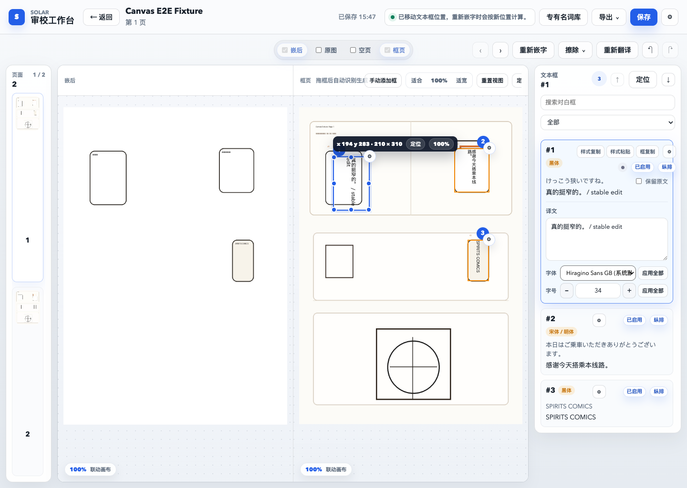
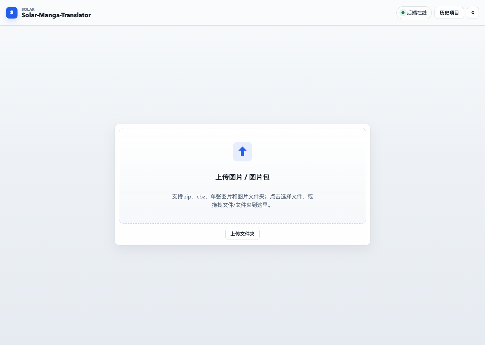
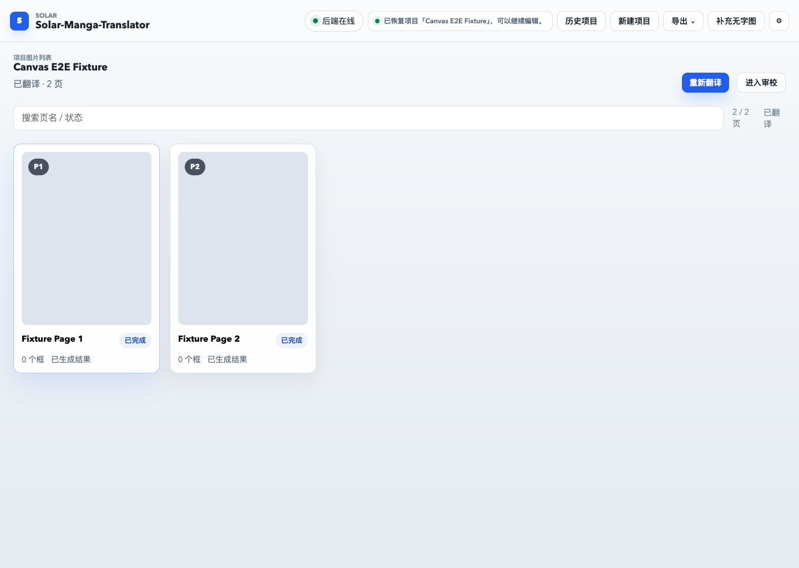
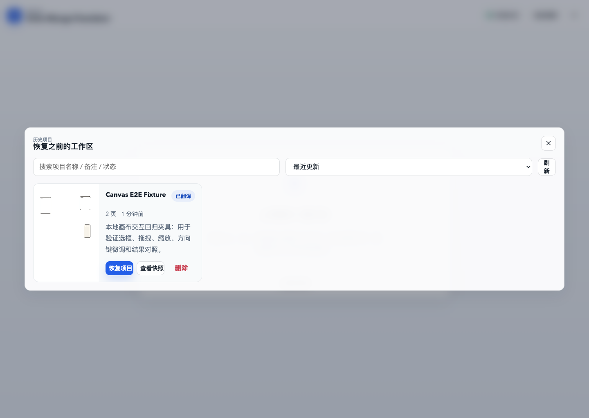

# Solar-Manga-Translator

[](https://github.com/soluna/Solar-Manga-Translator/actions/workflows/ci.yml)
[](LICENSE)
[](https://nodejs.org/)

面向中文用户的本地漫画翻译与审校工作台。它把图片导入、OCR、AI 翻译、擦字修补、自动嵌字、人工校对和导出放进同一个流程，适合在自己的电脑上处理有权使用的漫画、条漫和图像文本。

```text
导入图片 / ZIP / CBZ -> 文本检测与 OCR -> 擦字并生成空页 -> AI 翻译 -> 自动嵌字 -> 人工审校 -> 导出
```

> 当前仓库提供可运行源码，尚未发布预构建安装包。Windows 桌面打包仍处于实验阶段。
> 实际翻译建议使用 Windows + NVIDIA GPU，macOS 和 Linux 更适合开发、调试与轻量测试。



截图使用项目生成的合成演示素材，不包含真实漫画页面或受版权保护的内容。

## 它能做什么

| 阶段 | 能力 |
| --- | --- |
| 导入 | 单张图片、图片文件夹、`.zip`、`.cbz` |
| 识别 | 自动检测文本区域并执行 OCR |
| 翻译 | Gemini、豆包 Ark、OpenAI Compatible 等可配置服务 |
| 图像处理 | 擦除原文、背景修补、自动嵌入译文 |
| 人工审校 | 修改原文与译文、文本框、字体、字号、颜色、描边、排版方向和位置 |
| 项目管理 | 自动保存项目、创建快照、恢复历史项目、继续未完成工作 |
| 导出 | 导出处理后的图片或归档结果 |

它不是一个只给出最终图片的黑盒。程序先完成批量初稿，你可以在审校工作台逐页检查识别、翻译、修图和排版结果，再决定何时导出。

## 快速开始

### 准备环境

- Git
- Python 3.10 或 3.11
- Node.js 24 LTS；最低支持版本为 22.12
- 需要联网下载 Python 依赖、核心引擎和所选模型
- 使用在线翻译服务时，需要自行准备对应服务商的 API Key
- NVIDIA GPU 用户建议安装最新驱动；当前 CUDA 13 运行时要求 R580 或更高版本

首次启动会安装较大的机器学习依赖。Windows CUDA 运行时约 2 GB，终端会显示
下载进度；脚本会对 PyTorch 官方源和阿里云镜像做小流量测速，优先使用较快的
下载源，并在连接停滞或安装超时后自动切换。普通 Python/npm 依赖和固定版本核心
引擎也会在国内镜像与官方源之间回退；依赖没有变化时，后续启动会跳过重复安装。

### Windows

```bat
git clone https://github.com/soluna/Solar-Manga-Translator.git
cd Solar-Manga-Translator
start.bat
```

脚本会创建 `backend/venv`、检测 NVIDIA GPU、安装匹配的 PyTorch
CUDA/CPU 运行时、准备固定版本的核心翻译引擎、启动前后端并打开浏览器。RTX 50
显卡会使用支持 Blackwell 的 CUDA 运行时；若驱动过旧，脚本会在启动前给出明确提示。

### macOS

```bash
git clone https://github.com/soluna/Solar-Manga-Translator.git
cd Solar-Manga-Translator
chmod +x start.mac.sh
bash ./start.mac.sh
```

macOS 脚本使用独立的 `backend/.venv-mac`，不会影响 Windows 常用的 `backend/venv`。

### Linux

```bash
git clone https://github.com/soluna/Solar-Manga-Translator.git
cd Solar-Manga-Translator
chmod +x start.sh
./start.sh
```

启动脚本默认只在本机回环地址提供服务，并生成临时 API Token 保护会修改本地状态的接口。

## 使用流程

### 1. 导入图片

在首页拖入图片、图片文件夹、`.zip` 或 `.cbz`。应用会创建一个本地项目，原始素材和后续进度不会上传到本项目维护者的服务器。



### 2. 选择页面并配置翻译

确认页面顺序，在设置中选择翻译服务、目标语言、字体映射和图像处理方式。需要密钥的服务会把配置保存在本地，前端接口只返回脱敏状态。



### 3. 执行自动处理

列表页按三个可见步骤推进：识别完成文本检测、OCR、擦字并生成可编辑空页；翻译把译文回填到审校工作台并生成初稿；审校调整后可重新嵌字。长任务的当前步骤和进度会显示在界面顶部。

### 4. 人工审校

进入审校工作台，逐页修正文本区域、译文和样式。可以对照原图、擦除图与嵌字结果，也可以重新翻译、重新擦除或手动调整文本框。


### 5. 保存、恢复与导出

编辑会保存到本地项目。你可以创建快照、从历史列表恢复项目，完成检查后再导出图片或归档文件。



## 字体与本地数据

- `fonts/system` 存放项目随附的开源预置字体。
- `fonts/custom` 存放你自己拥有授权的字体，字体文件会被 Git 忽略。
- 应用只读取这两个目录，不扫描操作系统字体。
- “打开字体文件夹”会打开项目使用的 `fonts` 根目录。
- 项目、输出、设置、模型、缓存和日志默认保存在项目根目录的 `.runtime/`，不会提交到 Git。设置面板会显示当前运行实际使用的目录；如有需要，可用 `APP_DATA_DIR` 指定其他位置。
- 后端日志会持续追加并自动轮转；设置面板可以直接打开日志目录或导出脱敏诊断包。

升级代码不会主动删除历史项目。迁移旧版本数据前，建议先备份旧应用数据目录；若历史列表为空，请检查设置面板显示的应用数据目录是否与旧版本一致。

## 安全与隐私

- 后端默认只监听 `127.0.0.1`。
- 修改本地状态的 HTTP 接口和 WebSocket 会话由临时 API Token 保护。
- 保存的服务商密钥只保留在服务端本地配置中，API 响应会脱敏。
- 上传和归档处理会校验大小、路径、归档结构、文件类型和图片完整性。
- 桌面打包采用允许列表，只带入白名单开源字体和必要运行文件。

请只处理你拥有权利或获得授权的内容。安全问题请按照 [SECURITY.md](SECURITY.md) 私下报告。

## 当前状态与限制

- 源码启动流程可用，CI 会检查后端测试、前端构建、桌面脚本和仓库内容边界。
- 尚未发布正式 Windows 安装包，也没有完成代码签名。
- CPU 可以运行部分流程，但 OCR、修图和模型推理通常更适合 NVIDIA GPU。
- 首次运行可能下载较大的模型与依赖。
- 在线翻译的可用性、费用、限额和输出质量由所选服务商决定。
- 翻译与图像修补结果仍需要人工检查。

正式分发桌面安装包前，还需要在干净 Windows 环境执行 [发布检查清单](docs/release-checklist.md)，重新审计依赖并生成校验信息。

## 常见问题

### 设置里显示“检测到 NVIDIA 显卡，但当前安装的是 CPU 版 PyTorch”

关闭应用后重新运行 `start.bat`。脚本会改用 PyTorch 官方 CUDA wheel。RTX 50
用户还需要 NVIDIA R580 或更高驱动。可在 PowerShell 中检查：

```powershell
nvidia-smi
backend\venv\Scripts\python.exe -c "import torch; print(torch.__version__, torch.version.cuda, torch.cuda.is_available())"
```

### PyTorch 下载长时间没有进度

新版会实时显示下载进度，并在 PyTorch 官方源与阿里云镜像之间测速和自动切换。
单个连接连续 30 秒没有数据会重试或换源；只要下载仍在持续接收数据，就不会因为总耗时较长而中止。详细记录位于：

```text
<项目目录>\.runtime\logs\bootstrap.log
```

检测、OCR 和 LaMa 模型也使用带连接/读取超时、断点续传和 SHA-256 校验的下载器。
GitHub 或 Hugging Face 不可达时会尝试备用源，当前模型准备情况可在“运行环境检查”
中查看。

### API Base URL 或模型重启后不见了

新版会把设置写到设置面板显示的本地配置文件。“测试连接”和“保存并开始”都会先确认写入完成。
若仍失败，请导出诊断包并检查其中的 `diagnostics.json`；密钥会被脱敏。

### 手动添加框后 OCR 失败

框会先保存，再单独执行 OCR 和翻译。识别失败不会删除框，可以在右侧文本框中点击
“重新识别”，也可以直接填写译文。

### 到哪里找日志

打开设置，在“应用运行环境”中点击“打开日志目录”。需要反馈问题时可点击“导出诊断包”；
任务日志统一保存在 `logs/tasks/<项目>/`。诊断包包含最近日志和运行环境信息，并会
清理 API Key、Authorization、token、个人绝对路径以及 OCR/翻译正文。

更完整的首次使用问题分级和修复记录见
[首次使用就绪度复审](docs/first-run-readiness-review-2026-07-05.md)；
最新的真实端到端检查见
[全新用户端到端流程审查](docs/new-user-end-to-end-review-2026-07-06.md)。

## 开发

仓库主要目录：

| 路径 | 说明 |
| --- | --- |
| `backend/` | FastAPI 后端、本地路径管理、设置存储和翻译引擎集成 |
| `frontend/` | Vue 3 + Vite 前端及 Playwright 冒烟测试 |
| `desktop/` | Electron 桌面壳与 Windows 打包脚本 |
| `fonts/system/` | 允许随项目分发的开源预置字体 |
| `fonts/custom/` | 用户本地字体目录，文件不会进入 Git |
| `scripts/` | 本地辅助脚本与合成测试素材生成工具 |
| `docs/` | 发布检查、开源审计和桌面打包文档 |

后端开发：

```bash
cd backend
python3 -m venv venv
source venv/bin/activate
python -m pip install --upgrade pip
python install_deps.py
python -m pip install -r requirements.txt
```

前端开发：

```bash
cd frontend
npm ci
npm run dev
```

桌面开发：

```bash
cd desktop
npm ci
npm run dev
```

### 前后端分开启动（可选）

后端终端：

```bash
cd backend
source venv/bin/activate
export APP_API_TOKEN="$(python -c 'import secrets; print(secrets.token_urlsafe(32))')"
printf 'APP_API_TOKEN=%s\n' "$APP_API_TOKEN"
python -m uvicorn main:app --host 127.0.0.1 --port 8000
```

另开一个终端，把 `<same-token>` 替换为后端打印的 Token：

```bash
cd frontend
VITE_API_BASE_URL=http://127.0.0.1:8000 \
VITE_API_TOKEN="<same-token>" \
npm run dev -- --host 127.0.0.1
```

完整的贡献约定见 [CONTRIBUTING.md](CONTRIBUTING.md)，
桌面构建说明见 [desktop/README.md](desktop/README.md)。

## 测试

```bash
# 后端
python -m unittest discover backend/tests -v

# 前端
cd frontend
npm ci
npm run build
npm run test:canvas-preview
npm run test:review-workspace
npm run test:v2-workspace

# 桌面脚本
cd ../desktop
npm ci
node --check main.mjs
node --check preload.mjs
node --check scripts/dev.mjs
node --check scripts/stage-runtime.mjs
node --check scripts/package-win.mjs
```

## 仓库内容边界

本仓库不应包含：

- 漫画原图、翻译成品或含版权页面的测试截图
- `fonts/custom` 中的商业、私有或个人字体
- 模型权重、模型缓存和运行时下载缓存
- API Key、`.env`、本地日志、个人项目数据和个人机器路径
- 安装器、临时上传、输出目录和其他本地运行产物

提交 Pull Request 前，请确认没有把以上内容加入 Git。

## 贡献

欢迎通过 [Issues](https://github.com/soluna/Solar-Manga-Translator/issues)
报告问题或提出建议，也欢迎提交 Pull Request。
开始前请阅读 [CONTRIBUTING.md](CONTRIBUTING.md)
与 [CODE_OF_CONDUCT.md](CODE_OF_CONDUCT.md)。

提交代码时请说明改动原因、运行过的测试、迁移或兼容性影响，并确认没有加入私有数据、版权媒体、非白名单字体、模型权重或凭据。

## 许可证与致谢

Solar-Manga-Translator 以 GPL-3.0-only 发布，详见 [LICENSE](LICENSE)。

本项目集成并固定使用 `manga-image-translator` 作为核心图片翻译引擎，
并维护必要的运行时补丁。上游来源、许可证和第三方声明见
[NOTICE](NOTICE) 与 [THIRD_PARTY_NOTICES.md](THIRD_PARTY_NOTICES.md)。

核心引擎版本配置见 `backend/upstream.json`，
依赖快照见 `backend/requirements-upstream.txt`。
正式发布构建不应把固定 commit 替换为未固定分支。
