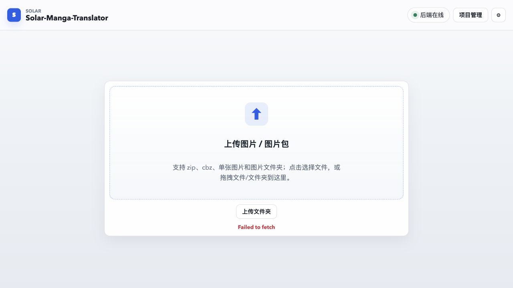
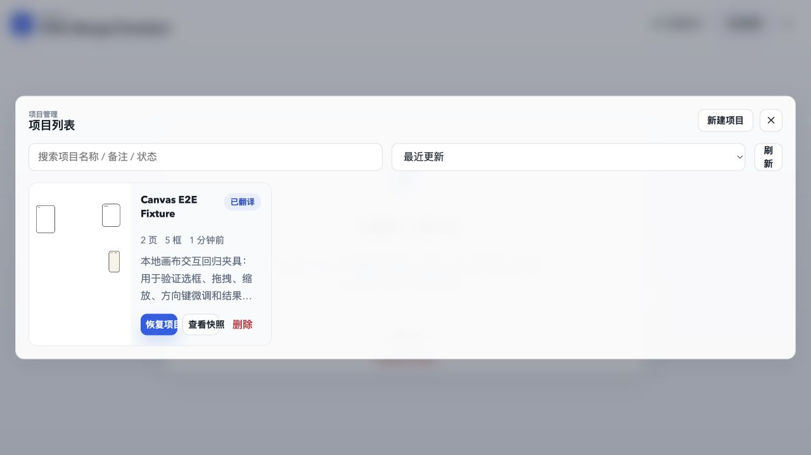
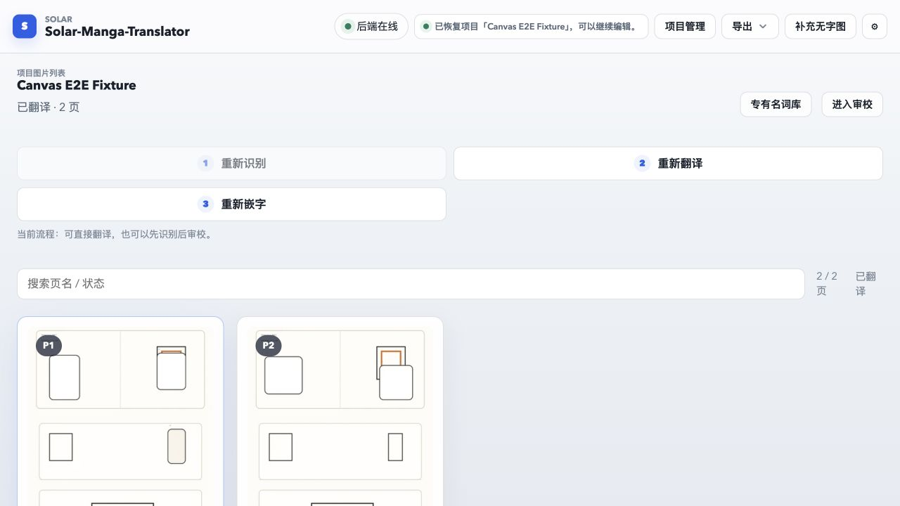

# 全新用户流程审查（2026-07-10）

## 审查范围

- 目标：第一次打开源码版应用的用户，能够理解如何创建或恢复项目，并清楚知道“识别、翻译、嵌字”各自产出什么。
- 覆盖步骤：首页、项目管理、页面列表与三阶段入口。
- 方式：使用隔离应用数据目录和合成测试项目，在 1280 × 720 桌面视口实际运行并截图。
- 限制：进入审校工作台时浏览器连接被中断；重启本地服务后，内置浏览器的本地 URL 策略拒绝再次进入，因此工作台修复后的视觉结果以自动化状态测试、后端契约测试和生产构建验证，未补截当前轮次的工作台截图。

## 步骤 1：首页 — 需改进

优点：上传入口是页面唯一主操作，文件类型和拖拽方式可见；后端在线状态明确。

问题：后端已经显示在线时，上传卡片下仍残留没有上下文的英文 `Failed to fetch`。新用户无法判断是启动瞬态、设置读取失败，还是上传能力不可用。应把可恢复的初始化失败与上传错误分开，并在后端恢复在线后清除过期错误。

可访问性风险：错误只有红色文字，没有错误来源、恢复动作或可关联到具体控件的说明；需要继续验证屏幕阅读器是否会在状态恢复后收到更新。

## 步骤 2：项目管理 — 需改进

优点：创建、恢复、快照、删除都能在一个入口找到，项目状态、页数和更新时间可见。

问题：单个项目卡片只占弹窗很窄的一列，大量空间闲置；缩略图、标题、说明和三个操作被挤在一起，说明被截断。刷新按钮也被压成两行。新用户很难快速扫描项目并判断“恢复项目”和“查看快照”的关系。

可访问性风险：卡片内多个小按钮彼此紧邻，删除与恢复距离过近；需要继续测量点击目标尺寸、键盘焦点顺序和危险操作确认。

## 步骤 3：页面列表与三阶段流程 — 有阻断性语义问题，已修复核心数据流

优点：项目状态、页数、文本框数和每页处理状态集中展示；专有名词库和进入审校入口易发现。

修复前问题：

1. 三个步骤在桌面宽度下排成两列加一行，视觉上不像连续流程。
2. “识别”只完成 OCR，空页到翻译阶段才生成，与步骤名称和用户预期冲突。
3. 审校画布会在没有译文时拿 OCR 原文作为预览兜底，因此即使底图被擦除，也会重新叠回原文。
4. 后端在没有嵌字结果时把原图 URL 回退成 `translated_image_url`，页面列表和“嵌后”视图会把原图误判成最终结果。
5. 页面卡片优先显示原图缩略图，阶段产出没有体现在列表预览中。

本轮修复：

- 识别阶段现在完成 OCR 后直接擦除原文并生成无字底图，再进入 `detected` 状态。
- 识别完成会让所有页面的底图缓存失效，工作台能载入最新空页。
- 审校画布只展示真实译文、人工译文或译文草稿，不再用 OCR 原文伪装成译文。
- 没有真实嵌字文件时，`translated_image_url` 保持为空；“嵌后”视图不再回退到原图。
- 页面列表在识别阶段优先显示空页，存在真实结果后优先显示译图。
- 步骤文案明确为“识别并生成空页 → 翻译并生成初稿 → 调整后重新嵌字”，并直接说明每一步产物。

仍需改进：把三个步骤固定为同一行或改为带连接线的纵向步骤条；为每步增加完成、当前、未开始状态，而不仅是可用/禁用。

## 优先级建议

1. P0：保留本轮已修复的阶段产物契约，并增加真实模型环境的一页 GPU 冒烟测试。
2. P1：首页清除过期 `Failed to fetch`，把错误归因到具体初始化请求并提供重试。
3. P1：重做项目管理列表的响应式栅格，保证卡片宽度、操作区和说明可扫描。
4. P1：把三步骤做成真正连续的状态组件，明确每步输入、输出和是否完成。
5. P2：补键盘全流程、焦点可见性、目标尺寸和 200% 缩放测试；截图只能指出风险，不能证明 WCAG 合规。
