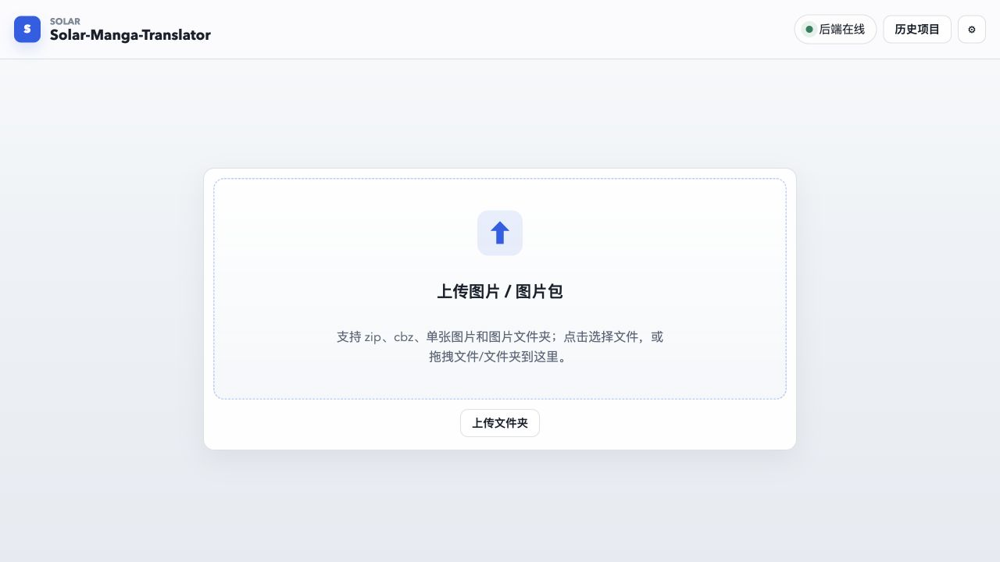
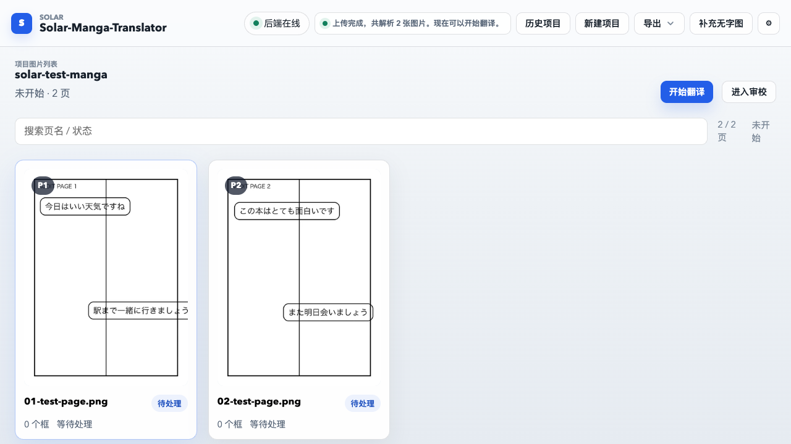
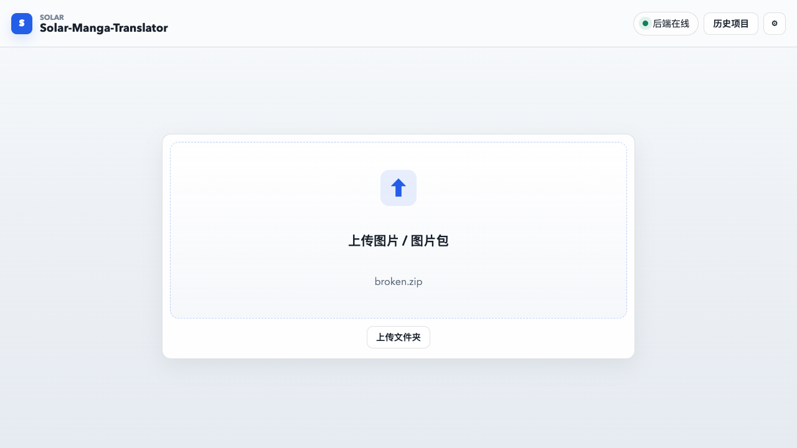
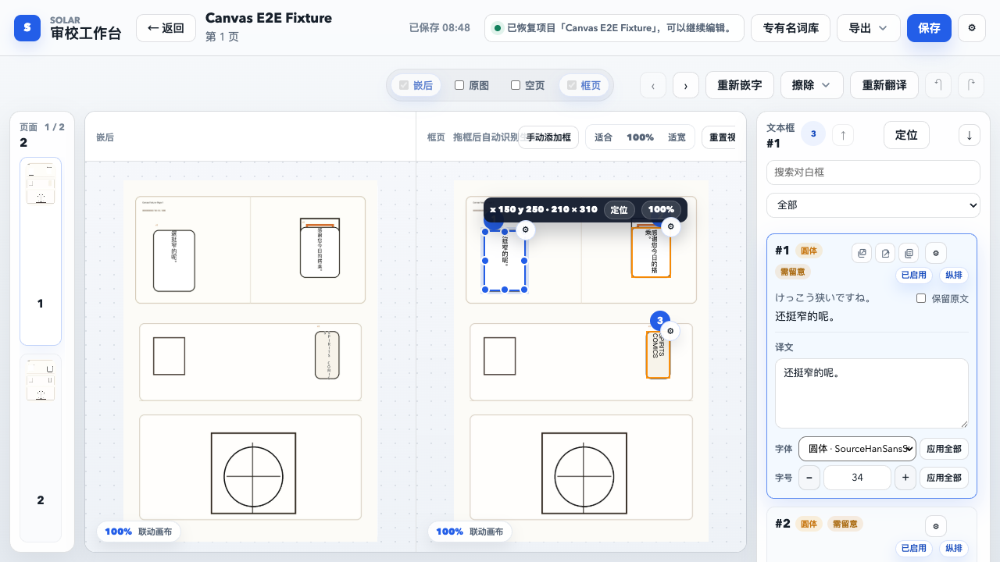
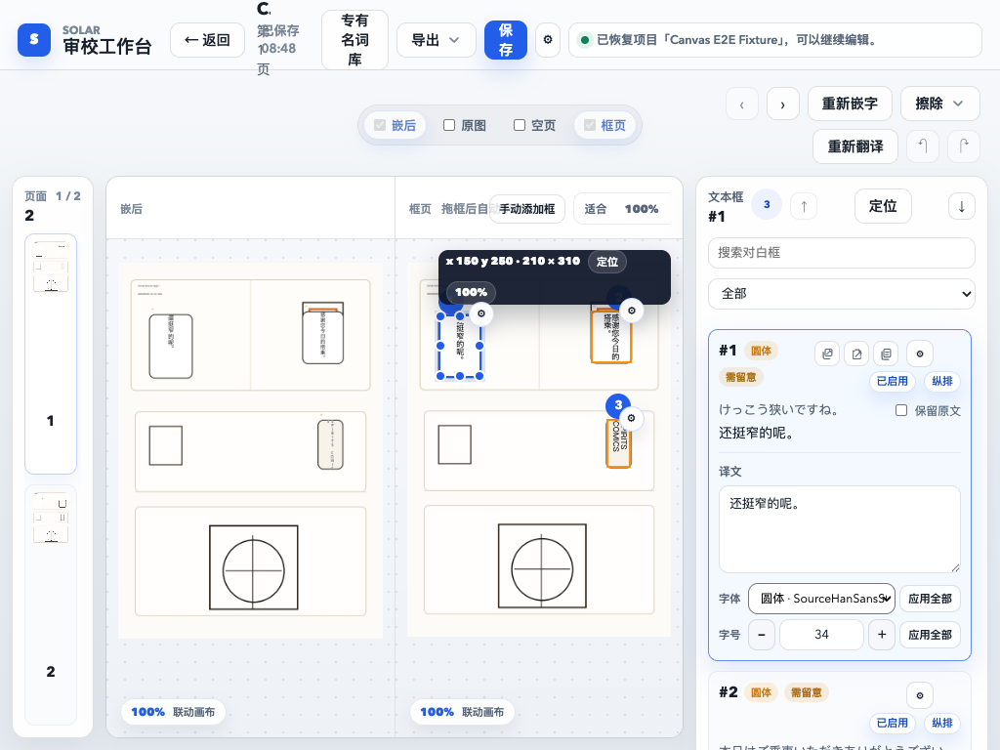
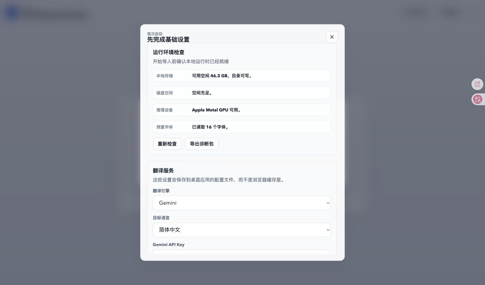
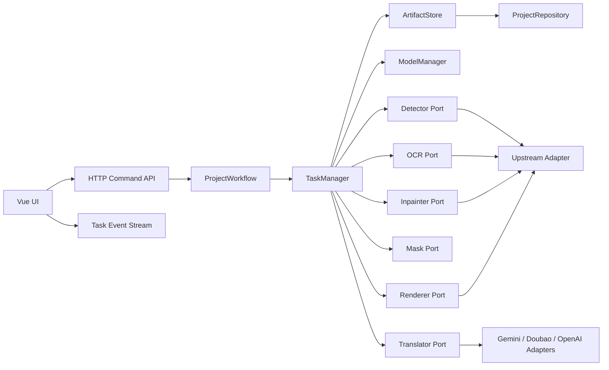

# 全新用户端到端流程审查

审查日期：2026-07-06
审查范围：首次安装、首次启动、配置、导入、识别、翻译、擦字、嵌字、人工审校、历史恢复、日志与导出

## 结论

本文件前半部分保留 2026-07-06 首次审查时的原始发现。其后已完成两轮针对性修复：
4 项 P0 代码缺陷和 10 项 P1 问题均已落地并进入自动化回归。
在完成全新 Windows + RTX 50 真机验收前，仍不应把源码启动描述为“所有环境一键可用”。

本轮确认：

- **P0 阻塞问题 4 项**
- **P1 严重问题 10 项**
- **P2 体验问题 7 项**
- 上传、历史恢复、手动框保存、已有缓存上的单页翻译、人工审校和导出等后半段能力基本可用
- 最大风险集中在真实推理入口：GPU 参数、模型准备、识别阶段边界、失败回滚和任务生命周期

上述问题数量和风险描述是首次审查快照。当前 4 项 P0 和 10 项 P1 已完成代码修复；
在干净 Windows + RTX 50 真机回归完成前，仍不建议把项目描述为“所有环境一键可用”。

## 2026-07-07 P1 收口状态

| 编号 | 状态 | 已落地内容 | 剩余发布验收 |
| --- | --- | --- | --- |
| P1-1 | 已修复 | 新增独立任务 ID、查询和取消接口；停止任务会取消协程并触发模型子进程终止与 staging 回滚；界面提供停止按钮 | Windows 真机确认长任务停止后显存及时释放 |
| P1-2 | 已修复 | 上传成功后才替换当前工作区；损坏 ZIP 保留项目、页列表和审校状态；首次上传失败在首页显示原因 | 大体积 ZIP 和断网场景人工验收 |
| P1-3 | 已修复 | 诊断页展示实际任务设备、推理命令契约和核心模型完整性 | 增加 Windows GPU 最小推理基准 |
| P1-4 | 已修复 | 任务日志统一保存，诊断包移除密钥、绝对路径和 OCR/译文 | 人工抽查真实用户诊断包 |
| P1-5 | 已修复 | WebSocket 只订阅任务事件；断线自动按事件序号续接；刷新后可从历史项目重新连接正在执行的任务 | 弱网和睡眠唤醒场景人工验收 |
| P1-6 | 已修复 | 迁移提示优先于首次设置，不再叠加；“暂不迁移”按应用版本记忆，升级后才再次询问 | 桌面版升级安装流程人工验收 |
| P1-7 | 已修复 | OCR、手动框翻译和本地修复共用 CUDA → MPS → CPU 设备选择器 | Apple Silicon 真机观察 OCR 实际设备 |
| P1-8 | 已修复 | 后端返回稳定错误码、用户摘要、建议动作和脱敏技术信息；完整堆栈仅写日志；界面可展开技术详情 | 补充更多第三方服务错误映射 |
| P1-9 | 已修复 | CI 覆盖上传→识别→翻译→导出契约、工作台浏览器 E2E，并新增断线续接与上传失败回归 | GPU 冒烟仍需自托管 Windows runner |
| P1-10 | 已修复 | 依赖指纹未变化时跳过安装；PyPI、npm、PyTorch、模型和上游源码均有超时或镜像回退 | 首次安装仍受用户网络和镜像可用性影响 |

本轮新增验证包括：任务断线续接、任务取消、错误脱敏、迁移版本记忆、MPS 设备选择、
损坏 ZIP 保留工作区，以及完整工作台浏览器 E2E。前端生产构建和设置持久化测试通过。

## 2026-07-07 P2 前置架构支撑

为后续处理 P2 体验问题，本轮先做了轻量接口收口，而不是直接大规模拆分页面：

- 后端任务事件统一补充 `task_action`、`action_label`、`workflow_phase`、`phase_label`、`scope`、`progress_current`、`progress_total` 和默认用户文案。
- 前端新增纯函数工作流状态模块，集中计算项目主按钮、审校主按钮、任务开始/进度/失败文案和工作流阶段标签。
- 前端新增纯函数任务事件状态模块，集中处理重复事件过滤、活动任务 ID / 序号、阶段信息、进度和状态文案派生；`AppV2.vue` 继续负责 WebSocket、图片预载、完成恢复等副作用。
- `AppV2.vue` 继续保留原界面结构，但不再在多个位置重复判断 `detect`、`translate-page`、`rerender` 等动作。

这一步的目标是让 P2-1 到 P2-5 后续可以围绕同一套阶段和命令模型落地：
开始前确认、稳定按钮、阶段进度、费用风险提示和可取消提示都应基于这些字段继续扩展。

本轮新增验证包括：`task-event-state` 纯函数测试、既有 `workflow-state` 测试、设置持久化测试、前端生产构建，以及完整工作台浏览器 E2E。

## 2026-07-07 P2 第一批体验收口

| 编号 | 状态 | 已落地内容 | 剩余验收 |
| --- | --- | --- | --- |
| P2-1 | 已修复 | 新用户默认使用“先识别再翻译”的分步流程；上传完成后提示先识别并校对 | 观察真实首次用户是否理解“识别”和“翻译”的区别 |
| P2-2 | 已修复 | 项目页改为固定阶段按钮：识别文本框、翻译整本/继续翻译、重新嵌字 | 后续可继续加入每步说明和风险提示 |
| P2-3 | 已修复 | 0 个框时入口文案改为“手动标框”，不再暗示已有可审校内容 | 可继续在空框页面增加首个框引导 |
| P2-4 | 部分修复 | 顶部任务状态展示阶段序号、阶段名称、范围和页进度 | 仍需把模型下载、检测、OCR、翻译、擦字、嵌字拆成更细粒度实时进度 |
| P2-5 | 已修复 | 批量翻译前确认页数、文本框数、翻译服务、费用不确定性和可停止说明 | 后续若服务商暴露价格，可补充真实费用估算 |

## 2026-07-06 修复状态

| 编号 | 状态 | 已落地内容 | 剩余发布验收 |
| --- | --- | --- | --- |
| P0-1 | 已修复 | 通用参数移到 `local` 后；使用上游真实解析器验证 `use_gpu=True` 与应用模型目录；任务日志上报实际设备 | Windows RTX 50 真机观察 GPU 利用率 |
| P0-2 | 已修复 | `detect` 只预加载检测与 OCR，并在文本行合并后返回；翻译、蒙版和 LaMa 延后到翻译阶段 | 用真实章节比较新旧检测质量与翻译阶段去字质量 |
| P0-3 | 已修复 | 检测和翻译写入 staging；成功后替换，失败或连接中断时恢复旧输出、缓存、归档和项目状态 | Windows 强制终止进程测试 |
| P0-4 | 已修复 | 核心模型统一使用超时、重试、断点续传、国内备用源和 SHA-256 校验；任务显示下载状态 | 中国大陆全新 Windows 网络实测 |
| P1-3 | 已修复 | 诊断页增加推理命令契约、实际任务设备和 4 个核心模型准备状态 | 可继续增加小模型真实推理基准 |
| P1-4 | 已修复 | 任务日志统一到 `logs/tasks`；停止上游重复日志；诊断包移除密钥、绝对路径和 OCR/译文 | 人工抽查用户真实诊断包 |
| P1-9 | 已修复 | CI 增加上传→识别→翻译→导出 mock provider 契约测试和浏览器工作台 E2E | GPU 冒烟仍需自托管 Windows runner |
| P1-10 | 已修复 | 依赖指纹未变化时跳过安装；PyPI/npm 自动镜像回退；固定上游支持校验归档回退 | 首次安装仍受用户网络与镜像可用性影响 |

自动化验证包括后端 140 项单元测试、前端设置持久化、生产构建、工作台浏览器 E2E、
真实上游 CLI 参数解析，以及镜像 Range 请求探测。P0-4 在此前只解决了 PyTorch；
检测、OCR 与 LaMa 模型下载是在本轮才补齐。

## 首次审查方法（修复前快照）

首次审查没有只看代码，实际执行了以下验证：

1. 使用独立 `APP_DATA_DIR` 启动前后端，隔离日常项目数据。
2. 生成 2 页、900 × 1200 的日文合成漫画页，打包为 ZIP。
3. 通过真实 UI 和真实 `/api/upload` 分别上传。
4. 触发真实 `detect`、`translate`、`translate-page` WebSocket 任务。
5. 检查任务进程、内存、日志、输出目录、项目索引和页面文档。
6. 模拟无效 API Key、损坏 ZIP、浏览器断开和任务失败。
7. 重启后端，验证历史项目和页面状态恢复。
8. 使用持久化测试夹具验证审校、拖拽、键盘微调、补充底图、单页翻译和导出。
9. 在 1280 × 720、1024 × 768 两个桌面视口检查工作台。
10. 执行后端 111 项测试、前端构建、画布测试、设置持久化测试和工作台 E2E。

限制：

- 本轮实际推理环境是 macOS Apple Silicon。Windows CUDA 安装逻辑通过单元测试和命令解析检查验证，但没有一台全新 Windows + RTX 50 机器用于本轮真机回归。
- 单页翻译在已有识别缓存的夹具上使用本地已配置凭据成功完成；全新项目无法跨过当前识别 P0，因此不能算完整的干净环境端到端成功。

## 用户旅程结果

| 步骤 | 结果 | 说明 |
| --- | --- | --- |
| 安装依赖 | 部分通过 | PyTorch 已有超时和镜像策略；上游仓库、普通 pip/npm 依赖和模型文件仍可能阻塞 |
| 首次启动 | 部分通过 | 环境信息可见；模型未纳入完整预检；升级场景会叠加两个弹窗 |
| 配置翻译 API | 通过 | OpenAI Compatible 地址和模型可持久化，连接验证有明确结果 |
| 上传图片/ZIP | 通过 | 2 页 ZIP 正确解析、排序并创建本地项目 |
| 上传失败恢复 | 失败 | 损坏 ZIP 会清空当前工作区，首页不展示错误原因 |
| 自动识别 | 阻塞 | GPU 和模型目录参数被静默覆盖；“仅识别”仍依赖翻译 API、擦字和修复 |
| 自动翻译 | 部分通过 | 已有识别缓存时单页翻译成功；无法证明全新项目完整跑通 |
| 手动画框 | 通过 | 框先保存，OCR 失败后仍保留，可重试或手填 |
| 人工审校 | 通过 | 译文、框位置、字号、字体、键盘微调和页面切换可用 |
| 历史恢复 | 通过 | 同一应用数据目录下，重启后项目仍可恢复 |
| 导出 | 通过 | 结果 ZIP 和无字底图 ZIP 的文件名、页序和内容均正确 |
| 日志与诊断 | 失败 | 日志分散；诊断包仍包含绝对路径和 OCR 文本，不宜公开上传 |

## 截图记录

### 1. 空白首页



入口明确，上传图片包和上传文件夹均可发现。

### 2. 真实 ZIP 上传完成



页面顺序和缩略图正确。但 0 个文本框时仍显示“开始翻译”和“进入审校”，没有解释两者接下来会做什么。

### 3. 损坏 ZIP 上传失败



失败后原项目退出，界面只保留 `broken.zip` 文件名，没有错误原因，也没有“返回刚才项目”。

### 4. 审校工作台



1280 宽度下主要流程可用。



1024 宽度下项目名称、页码和按钮发生不自然折行，画布 HUD 遮挡内容。若不计划支持此宽度，应明确最小窗口宽度并阻止继续缩小。

### 5. 首次设置与迁移弹窗叠加



这是有旧数据且缺少新设置的升级场景，不是纯净克隆场景。两个独立布尔状态会同时打开，用户必须处理两轮遮罩弹窗。

## P0 阻塞问题

### P0-1 推理任务实际没有使用检测到的 GPU 和应用模型目录

**实测证据**

任务命令包含 `--use-gpu` 和 `--model-dir`，但子进程打印的最终参数是：

```text
use_gpu=False
model_dir=None
```

当前命令把通用参数放在 `local` 子命令之前，见
[translator.py](../backend/engine/translator.py#L6062)。上游入口随后使用
`reparse(unknown)` 的默认值覆盖第一次解析结果，见
[__main__.py](../backend/manga-image-translator/manga_translator/__main__.py#L87)。

这会导致：

- 设置页可以显示“CUDA GPU 可用”，真实任务却仍跑 CPU。
- RTX 50 用户即使正确安装 CUDA PyTorch，也可能完全得不到推理加速。
- `APP_DATA_DIR/models` 与任务真实模型目录不一致。
- 模型可能重新下载到上游源码目录。

**修复方向**

1. 将所有通用参数放到 `local` 子命令之后，或修复上游二次解析覆盖逻辑。
2. 不再依赖打印命令判断设备；任务启动后上报实际 `device`、CUDA 版本和模型目录。
3. 增加命令契约测试，必须解析得到 `use_gpu=True` 和指定模型目录。
4. 在 Windows RTX 50、旧 NVIDIA、CPU、macOS MPS 四类环境做真机任务测试。

**验收标准**

- 诊断页设备、任务事件设备、子进程设备三者一致。
- 模型只写入设置页显示的模型目录。
- NVIDIA 任务日志包含真实 CUDA 设备名，且 GPU 利用率可观察。

### P0-2 “仅识别”仍耦合翻译服务、蒙版和 LaMa 修复

**实测证据**

- 使用无效 Gemini Key 执行 `detect`，任务在 OCR 前初始化翻译器并失败。
- 使用可连接的翻译配置执行 `detect`，日志继续进入 `mask refinement` 和 `LamaLargeInpainter`。
- 两页合成图片在该阶段占用约 14 GB 内存并长时间没有新的前端进度。

`detect_session()` 实际调用上游 `--prep-manual` 全流程，见
[translator.py](../backend/engine/translator.py#L4773)。上游会预加载检测、OCR、修复和翻译模型，见
[manga_translator.py](../backend/manga-image-translator/manga_translator/manga_translator.py#L402)，随后仍执行蒙版和修复，见
[manga_translator.py](../backend/manga-image-translator/manga_translator/manga_translator.py#L563)。

**修复方向**

建立真正独立的阶段：

1. `detect-text`：只做文本检测。
2. `recognize-text`：只做 OCR。
3. `translate-text`：只调用翻译服务并写入译文。
4. `build-mask`：只生成擦字蒙版。
5. `inpaint-page`：只生成无字底图。
6. `render-page`：只嵌字。

识别成功后应立即持久化文本框和 OCR 文本，不应等待擦字或翻译。

**验收标准**

- 没有 API Key、API 断网或翻译服务 403 时，检测和 OCR 仍可完成。
- 关闭擦字时不加载 LaMa。
- 每个阶段可独立重试，不删除其他阶段的成功产物。

### P0-3 重新识别或重新翻译会先删除已有成功结果

**实测证据**

对一个已有 2 页译图的项目执行“重新翻译”：

1. 任务开始后，原 `translated` 目录立即被清空。
2. 新任务因 API Key 无效失败。
3. 项目索引仍显示“已翻译”，但 `translated_images` 为空，下载地址也为空。

清空发生在新任务任何成功结果产生之前，见
[translator.py](../backend/engine/translator.py#L4783)。前端也会立即清空译图和下载状态，见
[AppV2.vue](../frontend/src/AppV2.vue#L10008)。

**修复方向**

- 每次任务写入独立 staging 目录。
- 成功后原子替换正式输出；失败、取消或进程崩溃时删除 staging，保留旧结果。
- 任务前自动创建恢复点。
- 项目状态和文件提交必须处于同一个事务边界。

**验收标准**

- 重翻译失败后，旧译图、下载和审校数据保持不变。
- 项目索引状态与磁盘实际产物一致。

### P0-4 首次模型准备不适合中国大陆网络

PyTorch wheel 已有官方源和阿里云镜像测速，但 OCR、检测和修复模型仍在首次推理时由上游代码下载。

当前下载器：

- 主要访问 GitHub Release。
- `requests.get()` 没有连接或读取超时，见
  [generic.py](../backend/manga-image-translator/manga_translator/utils/generic.py#L148)。
- 没有镜像选择、统一重试和任务取消。
- 下载进度只写子进程日志，前端通常只停留在“识别中”。
- 运行时诊断不检查检测、OCR、LaMa 模型是否完整。

**修复方向**

新增独立 `ModelManager`，在首次设置中完成：

- 模型清单、版本、大小、SHA-256 和许可证展示。
- 官方源与国内镜像测速。
- 连接超时、读取停滞超时、断点续传和取消。
- 每个模型的实时下载进度。
- 下载完成后再开放对应任务。

**验收标准**

- 纯净 Windows 环境可在官方源不可达时自动切换镜像。
- 所有模型都保存到应用模型目录并通过哈希校验。
- 用户能区分“下载中、校验中、加载中、推理中”。

## P1 严重问题

| 编号 | 问题 | 证据与影响 | 建议 |
| --- | --- | --- | --- |
| P1-1 | 没有任务取消能力 | 关闭 WebSocket 后子进程继续运行，项目保持 busy；界面没有停止按钮 | 建立持久任务 ID、取消接口和子进程树终止逻辑 |
| P1-2 | 上传失败会丢失当前工作区 | 前端在请求成功前清空项目，见 [AppV2.vue](../frontend/src/AppV2.vue#L9938)；失败后首页也不显示错误 | 上传成功后再切换项目；失败时保留当前项目并显示可操作错误 |
| P1-3 | 运行环境检查给出错误安全感 | 只检查 PyTorch、磁盘和字体，没有验证推理命令实际设备及模型完整性，见 [main.py](../backend/main.py#L425) | 增加真实最小推理自检和模型清单 |
| P1-4 | 日志分散且诊断包并未充分脱敏 | 日志散落在 `logs`、`cache`、上游 `result`；诊断包包含绝对用户路径和 OCR 文本 | 统一任务日志目录；默认移除路径、项目名、OCR/译文，只允许用户显式选择附加内容 |
| P1-5 | 浏览器断开不拥有任务生命周期 | WebSocket 同时承担命令、进度和任务所有权，断开后无法可靠重连或取消，见 [main.py](../backend/main.py#L1294) | 任务独立于连接，WebSocket/SSE 只作为事件订阅 |
| P1-6 | 升级弹窗会叠加且“暂不迁移”会再次出现 | 首次设置和迁移分别独立打开；存在未迁项目时 `skipped` 仍计算为 needed，见 [runtime_paths.py](../backend/runtime_paths.py#L303) | 使用单一启动向导状态机；记录“本版本不再提醒” |
| P1-7 | macOS 手动框 OCR 硬编码 CUDA | 诊断显示 MPS 可用，但手动识别传入 `"cuda"`，见 [translator.py](../backend/engine/translator.py#L8617) | 统一使用设备选择器，不在局部功能重新判断 |
| P1-8 | 任务失败直接返回内部堆栈 | 无效 API Key 会把上游调用栈和底层错误整段展示给用户 | 定义稳定错误码、用户摘要、建议动作和“查看技术详情” |
| P1-9 | 当前 CI 没有覆盖真实主链路 | E2E 从已翻译夹具开始，不覆盖上传、模型准备、识别、翻译、取消和导出 | 增加 mock provider + 小模型/假适配器的完整 E2E，并在 Windows 做 GPU 冒烟 |
| P1-10 | 源码启动仍有多个网络阻塞点 | 每次启动都会运行 pip/npm 安装；上游 Git fetch、普通依赖和模型没有统一国内镜像策略 | 依赖指纹无变化时跳过安装；统一下载器和代理/镜像配置 |

## P2 体验问题

| 编号 | 问题 | 建议 |
| --- | --- | --- |
| P2-1 | 默认上传后直接显示“开始翻译”，完整流程成本和耗时不透明 | 首次项目默认分步模式，先识别并预览，再由用户确认翻译 |
| P2-2 | 同一主按钮会随状态变成识别、继续翻译、本页翻译或重嵌字 | 保持稳定的阶段按钮，或明确显示下一步阶段和影响范围 |
| P2-3 | 0 个框时仍能“进入审校” | 改为“手动标框”，并解释尚未自动识别 |
| P2-4 | 只有整页完成进度，没有模型下载和页内阶段进度 | 展示模型、检测、OCR、翻译、擦字、嵌字六段进度 |
| P2-5 | 批量翻译前没有页数、预计费用和可取消提示 | 在开始前展示页数、待翻译框数、服务商和费用风险 |
| P2-6 | 1024 宽度工作台信息层级失效 | 设定合理最小宽度；窄屏切换单画布和抽屉式侧栏 |
| P2-7 | 设置抽屉过长，运行环境、项目配置和高级图像能力混在一起 | 拆成“运行环境、翻译服务、项目流程、字体、图像处理”五个标签页 |

## 已确认可用的能力

以下部分不应在重构中退化：

- ZIP、CBZ、单图和文件夹上传接口的结构已较清晰。
- 历史项目在相同应用数据目录下可跨后端重启恢复。
- OpenAI Compatible 的 Base URL 和模型名称可持久化。
- 手动框先保存、后识别；OCR 失败不会删除框，相关单元测试已覆盖。
- 页面译文修改、框拖拽、键盘微调、字号和字体修改可保存。
- 结果 ZIP 与无字底图 ZIP 可按正确页序导出。
- API Token、归档路径穿越、压缩炸弹、字体目录边界和密钥脱敏已有测试。
- 本轮后端 111 项测试、前端构建和现有工作台 E2E 全部通过。

## 当前明显耦合

| 当前耦合 | 现状 | 目标边界 | 优先级 |
| --- | --- | --- | --- |
| 识别 + 翻译 + 擦字 + 修复 | `detect` 通过上游整条流水线完成 | 独立 Detector、OCR、Translator、Mask、Inpainter、Renderer 接口 | P0 |
| 输出目录 + 任务执行 | 任务开始即修改正式输出 | staging 产物仓库 + 原子提交 | P0 |
| WebSocket + 任务所有权 | 连接断开影响状态但不终止进程 | 持久 `TaskManager`，传输层只订阅事件 | P1 |
| 模型下载 + 第一次推理 | 推理过程中隐式下载 | 独立 `ModelManager` | P0 |
| 应用设置 + 项目设置 + 密钥 | 一个前端 `config` 同时承担全部配置 | Provider Profile、App Settings、Project Workflow Config | P1 |
| UI + 全部业务状态 | `AppV2.vue` 约 12,800 行 | Upload、History、Task、Review、Settings 独立 store 与模块 | P1 |
| 项目仓库 + 推理编排 + 渲染 | `TranslatorEngine` 约 10,400 行 | ProjectRepository、WorkflowService、RenderService | P1 |
| 日志 + 用户错误 | 原始子进程日志直接进入 UI 或诊断包 | 结构化错误事件 + 私密技术日志 | P1 |
| 运行时补丁 + 每次任务 | 每个任务重复同步上游补丁 | 安装/启动期准备并校验版本 | P2 |

## 建议目标架构



建议保留一个深模块 `ProjectWorkflow`，对外只暴露少量命令：

```text
import_project
detect_text
recognize_regions
translate_regions
build_page_base
render_pages
export_project
```

每个命令返回 `job_id`，任务状态至少包含：

```text
queued / preparing_models / running / cancelling / cancelled / failed / completed
```

## 自动化测试缺口

现有 E2E 从预制的已翻译项目开始，因此无法发现本轮 4 个 P0。建议新增以下流水线：

1. **命令契约测试**：真实解析 `_build_command()`，断言设备和模型目录。
2. **全流程假适配器 E2E**：上传 ZIP -> 检测 -> OCR -> mock 翻译 -> 擦字 -> 渲染 -> 导出。
3. **失败原子性测试**：重翻译失败后旧结果仍存在。
4. **取消测试**：任务取消后子进程树退出、busy 清除、旧产物保留。
5. **模型下载测试**：官方源超时后切镜像，断点续传和哈希失败可恢复。
6. **断线重连测试**：刷新页面后继续查看任务进度。
7. **上传失败 UI 测试**：损坏 ZIP 不退出当前项目，并显示错误。
8. **诊断包隐私测试**：不包含用户名、绝对路径、原文、译文和密钥。
9. **Windows GPU 冒烟**：至少覆盖 RTX 50 和一张旧架构 NVIDIA 卡。
10. **桌面视口回归**：1280 × 720 为最低支持宽度；更窄窗口给出明确处理。

## 建议实施顺序

### 第一阶段：阻止数据丢失和错误设备

1. 修复命令参数解析，补命令契约测试。
2. 正式输出改为 staging + 原子替换。
3. 将 detect/OCR 从翻译和修复中拆出。
4. 给任务增加停止按钮和后端取消接口。

### 第二阶段：让全新用户能稳定开始

1. 建立 ModelManager、镜像、超时和前端下载进度。
2. 完善首次启动预检，运行一次最小检测/OCR 自检。
3. 重做首次设置与旧数据迁移为单一状态机。
4. 修复上传失败保留上下文和错误反馈。

### 第三阶段：可支持、可维护

1. 统一日志目录和结构化错误码。
2. 修复诊断包隐私边界。
3. 拆分 `AppV2.vue`、`TranslatorEngine` 和 WebSocket 动作分发。
4. 将完整主链路 E2E 和 Windows GPU 冒烟加入发布门禁。

## 发布门禁

满足以下条件后，才建议对普通用户宣传“可直接使用”：

- [ ] 4 项 P0 全部关闭并有自动化回归。
- [ ] 全新 Windows + RTX 50 从克隆到导出完整成功。
- [ ] 官方模型源不可达时，国内镜像完整成功。
- [ ] 任务失败和取消不会破坏已有结果。
- [ ] 无翻译 API 时检测和 OCR 仍可独立运行。
- [ ] 诊断包不包含个人路径、漫画文本、译文和密钥。
- [ ] 1280 × 720 工作台无裁切、遮挡和按钮溢出。
- [ ] CI 覆盖真实上传到导出的完整状态机。
- [ ] README 对安装体积、模型体积、预计耗时和支持平台描述与实测一致。
