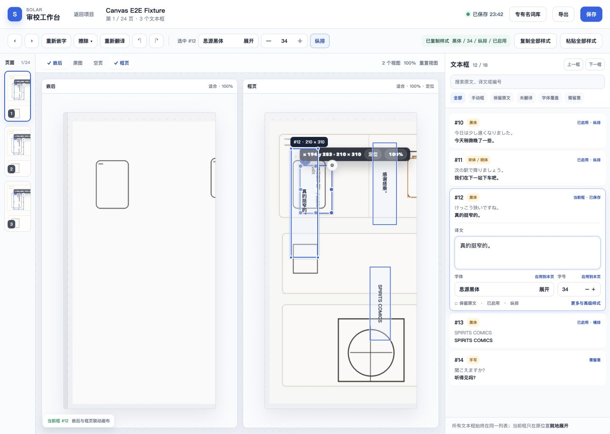
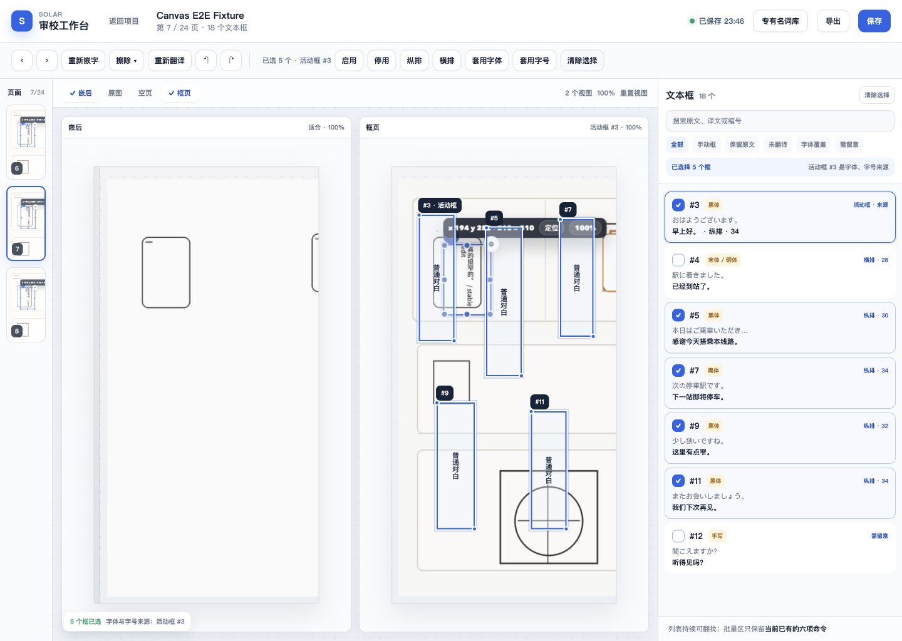

# 专业漫画审校工作台交互重构方案

状态：讨论稿 0.2（现有能力约束版）
更新：2026-08-01
目标用户：以逐页、逐框方式完成翻译校对与嵌字排版的专业漫画翻译者
本期范围：**只调整现有功能的布局、层级、入口、文案和操作路径，不增加业务能力**

## 0. 本期边界

这版方案以当前审校页已经存在的命令和状态为白名单。原方案中超出白名单的内容已经删除，不作为本期设计或实施依据。

### 0.1 可以调整什么

- 同一个现有命令放在哪里、是否常驻、是否收进菜单。
- 右侧文本框卡片如何折叠、展开、排序和保持滚动位置。
- 单选、多选时，同一批现有命令如何减少重复入口。
- 按钮名称、分组、状态提示和作用范围说明。
- 现有画布、页面轨、对照区和右侧列表之间的空间分配。
- 复制样式后，把当前已经存在的样式剪贴板状态显示得更清楚。

### 0.2 当前能力白名单

| 类别 | 本期可使用的现有能力 |
| --- | --- |
| 文本框查找 | 当前页完整列表、搜索、全部、手动框、保留原文、未翻译、有字体覆盖、需留意筛选 |
| 单框编辑 | 修改译文、保留原文、启用/停用、纵排/横排、字体、字号 |
| 样式复用 | 复制一个框的全部样式、把全部样式粘贴到一个目标框 |
| 页内统一 | 把当前框字体应用到当前页、把当前框字号应用到当前页 |
| 多选批量 | 启用、停用、纵排、横排、套用活动框字体、套用活动框字号 |
| 高级样式 | 旋转、描边强度、字距、行距、文字色、描边色、保留底图 |
| 文本框操作 | 画布选择、移动、缩放、定位、复制文本框、手动加框、识别/重新识别、删除手动框 |
| 画布与对照 | 嵌后、原图、空页、框页；现有 2–3 画布组合、缩放与重置 |
| 页面操作 | 上一页、下一页、重新嵌字、擦除及其现有方式、继续/重新翻译、撤销、重做 |
| 项目操作 | 专有名词库、保存、导出 |

### 0.3 明确不在本期

| 从原方案移除 | 原因 |
| --- | --- |
| 样式刷、连续点击套用 | 当前没有该操作 |
| 多选后粘贴“全部样式” | 当前多选只支持启停、方向、字体和字号 |
| 命名样式、项目级样式库 | 当前没有样式实体和引用关系 |
| 仅字体/字号等样式子集 | 当前复制和粘贴只有“全部样式” |
| 问题队列、完成后自动下一项 | 当前只有“需留意”等列表筛选 |
| 文本溢出/密度检测、自动适配字号 | 当前没有相应检测和处理命令 |
| 文字/排版/质检工作模式 | 当前没有模式状态 |
| 页面问题数、完成状态、稍后处理 | 当前没有相应数据状态 |
| 字体收藏、最近使用、项目范围批量 | 当前没有相应数据和作用域 |
| 新快捷键、命令面板、自定义快捷键 | 当前没有这些命令入口 |
| 单画布模式、按住按键临时对照 | 当前对照区使用 2–3 个画布 |
| 用自动保存替代“保存” | 当前仍有明确保存命令，本期保留 |
| 改变“全部样式”的字段语义 | 当前样式快照包含启用状态，本期只在界面中明确提示 |

## 1. 修订后的原型图

原型只展示两种当前已经存在的选择状态：单选与多选。两张图都保留左侧页面轨、中央现有对照画布，以及右侧同一页全部文本框的连续列表。

### 1.1 单框编辑：列表中就地展开

图中只重排现有能力：

- 顶部保留专有名词库、保存和导出。
- 页面级命令形成独立分组，避免和文本框格式混在一起。
- 选中框后，字体、字号、方向、复制全部样式和粘贴全部样式成为稳定入口。
- 复制后持续显示现有样式快照的摘要，并明确“全部样式包含启用状态”。
- 右侧所有文本框始终在同一列表；当前卡片只在原位置展开。
- “应用全部”改名为“应用到本页”，不改变实际作用范围。
- 高级样式从遮挡画布的浮层改为当前卡片内的展开区。

### 1.2 多框编辑：只显示现有批量命令

图中不提供整套样式粘贴：

- 右侧列表继续显示全部文本框，并用勾选标识多选结果。
- 顶部只保留现有六项批量命令：启用、停用、纵排、横排、套用活动框字体、套用活动框字号。
- “活动框”在列表和画布中都有明确标识，避免用户不知道字体和字号从哪里取值。
- 不再同时在画布浮条、右侧顶部和卡片内部重复三套批量入口。

可继续调整的 HTML 原型位于 [review-workspace-redesign-concepts.html](prototypes/review-workspace-redesign-concepts.html)。

## 2. 现状判断

### 2.1 应该保留的结构

右侧“当前页全部文本框在同一页连续排列”是正确的专业工具结构。它同时承担：

- 按顺序检查整页文本。
- 快速翻找某个编号、原文或译文。
- 比较相邻框的字体、字号、方向和状态。
- 多选分散在页面不同位置的目标框。

因此本期不把右侧拆成“对象列表”和“属性面板”两个互斥页面，也不让选择一个框后覆盖整个列表。

### 2.2 目前效率低的原因

1. 当前卡片展开后过高，用户很快失去整页列表上下文。
2. 字体、字号和样式复用埋在卡片内部，频繁操作需要反复滚动。
3. 复制样式只有短暂提示，之后看不到复制来源和大致内容。
4. 单框和多框命令在画布浮条、右侧批量条、卡片按钮中重复出现。
5. “应用全部”没有写清楚其实只作用于当前页。
6. 高级样式浮层遮挡画布，也打断右侧列表浏览。
7. 页面级操作、项目级操作和文本框级操作视觉权重接近，容易误点。
8. 复制、粘贴、复制文本框和高级样式依赖尺寸很小的图标，识别成本高。

## 3. 目标交互结构

### 3.1 顶部应用栏：项目级命令

保留并分组：

- 返回项目、项目名、页码、保存状态。
- 专有名词库。
- 保存。
- 导出。

“保存”不会被自动保存状态取代。保存状态只用于反馈当前结果，不改变现有保存逻辑。

### 3.2 页面工具栏：页面级命令

保留现有命令并与格式命令拉开：

`上一页 | 下一页 | 重新嵌字 | 擦除 ▾ | 继续/重新翻译 | 撤销 | 重做`

调整重点：

- “擦除”仍使用现有下拉内容。
- “重新翻译”继续体现它的现有作用范围，不伪装成单框操作。
- 撤销和重做只保留一套入口。

### 3.3 画布与对照：保留现有组合

保留嵌后、原图、空页和框页，以及当前 2–3 个画布并排的能力。本期只做：

- 让已开启的画布状态更明显。
- 每个画布标题、缩放值、重置和适合操作对齐。
- 选中框在对应画布中的状态一致。
- 减少画布上与右侧重复的批量按钮。

不增加单画布模式、临时原图查看或新的对照快捷键。

### 3.4 右侧：列表优先、当前框就地展开

右侧固定为三层：

1. 列表工具区：当前选择、上一框/下一框、定位、搜索和现有筛选。
2. 连续文本框列表：当前页全部符合筛选的文本框。
3. 当前框展开内容：只在它原来的列表位置出现。

选中其他框时：

- 原卡片收起，新卡片就地展开。
- 列表排序不变。
- 尽量保留原来的滚动位置，只在新卡片不在可视区域时做最小滚动。
- 画布和列表使用同一个当前框状态。

## 4. 单框高频路径

### 4.1 选择命令区

选中一个框时，固定显示：

`当前框编号 | 字体 | 字号 | 纵排/横排 | 复制全部样式 | 粘贴全部样式`

这些都是现有命令的入口上移。右侧展开卡片仍保留完整字段，但不再重复放一组难辨认的小图标。

### 4.2 样式复制与粘贴

现有操作路径保持不变：

1. 选中来源框并完成字体、字号等调整。
2. 点击“复制全部样式”。
3. 选中一个目标框。
4. 点击“粘贴全部样式”。

只增强反馈：

- 复制后显示“已复制样式：思源黑体 / 34 / 纵排 / 已启用”。
- 粘贴按钮明确写“粘贴全部样式”，不使用无文字图标。
- 提示“全部样式包含启用状态”，忠实反映当前实现。
- 未复制时，粘贴入口保持禁用并说明原因。

本期不增加连续粘贴、多目标整套样式粘贴或样式字段选择。

### 4.3 字体和字号

字体、字号在顶部和当前展开卡片中显示同一状态：

- 顶部用于高频微调。
- 卡片用于阅读译文时顺手修改。
- 当前卡片中的“应用全部”分别改名为“字体应用到本页”和“字号应用到本页”。

只改文案，不改变当前页范围，也不增加筛选结果、同类文本框或整个项目等新范围。

### 4.4 低频操作

当前卡片把低频操作放在“更多与高级样式”展开区：

- 复制文本框。
- 旋转、描边、字距、行距、文字色、描边色、保留底图。
- 手动框的识别/重新识别和删除。

展开内容仍属于当前卡片，不以覆盖画布的浮层出现。

## 5. 多框路径

多选时，右侧列表不切页、不替换成另一块属性面板。顶部只显示当前已经存在的命令：

`已选 N 个 | 启用 | 停用 | 纵排 | 横排 | 套用活动框字体 | 套用活动框字号 | 清除选择`

交互要求：

- 活动框使用实心选中样式，其他已选框使用勾选样式。
- “套用活动框字体/字号”旁显示活动框编号，例如“来源 #3”。
- 一次只呈现一套批量入口；画布浮条不再重复相同按钮。
- 单框译文表单在多选时保持收起，避免误以为只在修改活动框。

本期不把“粘贴全部样式”加入多选状态。

## 6. 现有筛选如何使用

保留当前筛选：全部、手动框、保留原文、未翻译、有字体覆盖、需留意。

调整方式：

- 搜索和筛选固定在列表顶部，滚动卡片时仍可使用。
- 筛选只缩小当前连续列表，不进入新的“问题页”。
- 列表标题沿用当前的过滤结果数量。
- 清除搜索或筛选后恢复原列表和原滚动上下文。

本期不增加问题队列、问题类型、自动跳转或页面问题计数。

## 7. 现有入口的收口表

| 当前入口 | 本期调整后 |
| --- | --- |
| 卡片上的复制样式图标 | 单选命令区的“复制全部样式”文字按钮 |
| 卡片上的粘贴样式图标 | 单选命令区的“粘贴全部样式”文字按钮 |
| 卡片上的复制文本框图标 | 当前卡片“更多”中的“复制文本框” |
| 卡片和画布上的高级样式齿轮 | 当前卡片内“更多与高级样式” |
| 字体旁“应用全部” | “字体应用到本页” |
| 字号旁“应用全部” | “字号应用到本页” |
| 画布浮条与右侧重复批量按钮 | 顶部保留一套现有批量命令 |
| 对照复选框 | 保留能力，强化开启状态和画布标题对应关系 |
| 保存状态与保存按钮 | 两者都保留：状态用于反馈，按钮用于执行现有保存 |

## 8. 交互状态与防错

只使用当前已有状态，不引入新业务状态：

- 当前框、已选框、活动框必须在画布和列表中一致。
- 保存中、已保存、保存失败沿用现有反馈。
- 样式剪贴板为空或有内容时，粘贴按钮状态明确。
- 样式摘要包含启用状态，避免用户把“全部样式”误解为纯排版属性。
- 页内统一操作的按钮文案必须出现“本页”。
- 重新翻译、擦除和删除手动框保持现有确认与禁用逻辑。
- 撤销/重做沿用现有历史能力，不承诺新的跨页或跨项目事务。

## 9. 本期实施顺序

### 第一组：右侧列表

- 保持完整列表。
- 当前卡片就地、有限展开。
- 搜索和现有筛选固定在顶部。
- 高级样式改为卡片内展开。

### 第二组：高频格式与样式复用

- 单选命令区上移字体、字号、方向、复制全部样式和粘贴全部样式。
- 样式剪贴板摘要可见。
- “应用全部”改为“应用到本页”。

### 第三组：多选与页面操作去重

- 多选只保留六项现有批量命令。
- 明确活动框是字体和字号来源。
- 画布、右侧和顶部只保留一套相同命令。
- 页面级、项目级和文本框级操作分组。

## 10. 验收标准

| 目标 | 验收方式 |
| --- | --- |
| 不新增功能 | 原型中每个可见操作都能映射到当前已有命令或状态 |
| 列表始终可翻找 | 单选、多选和高级样式展开时，右侧仍能看到并滚动同一页其他框 |
| 高频改字效率提高 | 选中框后，无需滚动卡片即可修改字体、字号和方向 |
| 单目标样式复用清楚 | 已复制样式摘要、当前目标和“含启用状态”均可见 |
| 页内统一范围明确 | 所有整页字体/字号入口都出现“本页” |
| 多选不越界 | 只出现当前已有的启停、方向、套用活动框字体和字号 |
| 保存逻辑不改变 | 保存按钮、保存状态和失败反馈继续存在 |
| 对照能力不减少 | 仍可使用当前嵌后、原图、空页、框页和 2–3 画布组合 |
| 高级样式不遮挡画布 | 高级属性在当前卡片内展开，不打开覆盖中央画布的浮层 |

## 11. 本轮唯一待确认点

当前“复制全部样式”会把启用状态一起复制。为遵守本期“不新增、不改语义”，本方案先保留这一行为，只在复制摘要和粘贴入口旁明确提示。若要把启用状态从样式中移除，那应单独作为后续功能行为变更讨论，不混入本期交互重构。
