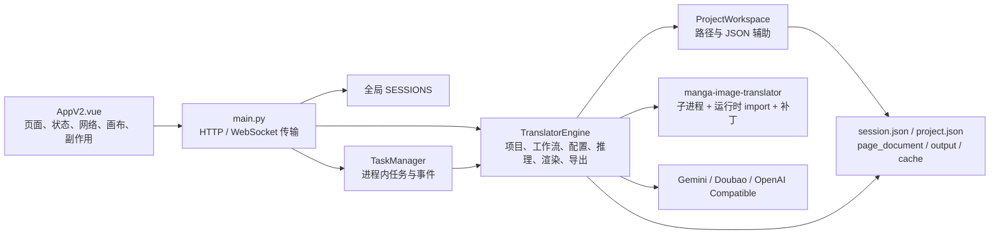
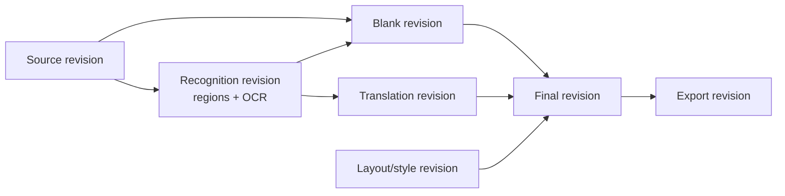
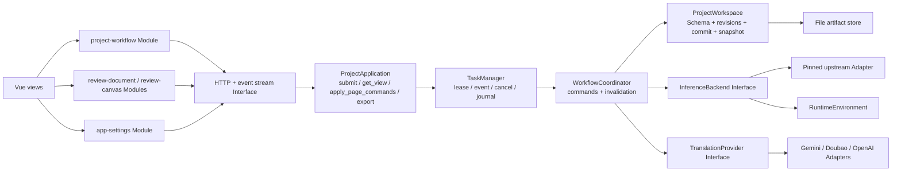

# 项目架构复审与整改清单（2026-07-10）

## 1. 文档目的

本文是对当前代码的独立架构复审，不把
[《全新用户端到端流程审查》](./new-user-end-to-end-review-2026-07-06.md)
的结论当作前提。旧文档只作为历史输入；本次结论以 2026-07-10 工作树中的实现、测试和实际模块关系为准。

本文有三个目标：

1. 判断旧报告提出的架构方向哪些应该保留、修正或放弃。
2. 找出已经被可靠性补丁遮住、但仍会持续制造状态错误和回归成本的根因。
3. 给出可以逐项实施、逐项验收、随时停止的迁移清单，避免大爆炸式重写。

本次是静态代码复审与本地自动化验证，不包含真实 GPU、真实模型下载、真实第三方翻译费用和 Windows 安装回归。

## 2. 执行摘要

### 2.1 总体判断

当前项目已经不是旧报告首次审查时的“主链路不可用”状态。4 项原 P0 的修复方向基本成立，取消、断线续接、结构化错误、诊断、依赖准备和 staging 也已经显著提高了可靠性。

但架构还没有完成真正的所有权迁移。当前形态更准确地说是：

> 一个可靠性明显增强、抽出若干辅助 Seam 的前后端双巨型 Module；状态、产物语义和副作用的主要所有权，仍集中在 `TranslatorEngine` 与 `AppV2.vue`。

本次没有仅凭静态审查确认新的 P0 阻塞项；发现的核心问题以 P1 架构风险为主。最高优先级不是继续按文件大小拆分，而是先建立“项目状态、页面状态、产物版本、失效规则”的唯一真相源。最近出现的“识别后仍像原图、翻译审校仍显示原文”正是这个缺口的直接表现。

### 2.2 建议保留与放弃的方向

应该保留：

- staging 后提交、任务与 WebSocket 解耦、固定上游版本、结构化错误、项目持久化。
- 把 `AppV2.vue` 和 `TranslatorEngine` 变薄，但必须伴随状态所有权迁移。
- 为上游推理引擎和第三方翻译供应商建立稳定 Adapter。

应该修正：

- 旧报告提出的独立 `Detector`、`OCR`、`Mask`、`Inpainter`、`Renderer` 接口过度拆分。它们目前没有多个可替换生产实现，且共享上游缓存和区域对象；拆成六个公开 Seam 会形成大量浅 Module。
- 旧报告的 `ProjectWorkflow` 公开七个流水线步骤，仍会把内部执行顺序暴露给调用方。外部 Interface 应围绕用户命令，而不是内部算法阶段。
- “持久 TaskManager”当前只实现了浏览器连接断开后的进程内续接，不是后端重启后的持久任务恢复。
- `ModelManager` 当前只是 64 行模型就绪度查询，不拥有下载、校验、设备和上游准备生命周期。

不建议做：

- 不拆微服务，不引入消息队列。
- 不为了拆 `AppV2.vue` 就先引入 Pinia 或全量 TypeScript。
- 不把六个流水线阶段各自做成公开接口。
- 不先按 `Repository` / `Service` / `Manager` 名字机械分层。
- 不先换 SQLite；文件存储可以继续使用，但必须有明确 Schema、revision 和提交协议。

### 2.3 整改总览

以下条目初始状态均为“待处理”。建议严格按 W0 → W8 推进；优先级表示风险，不表示可以跳过前置依赖。

| 编号 | 优先级 | 问题摘要 | 处理批次 |
| --- | --- | --- | --- |
| ARCH-01 | P1 | 缺少统一、类型化、可迁移的项目状态 | W1 |
| ARCH-02 | P1 | 产物依赖、失效和三步用户语义隐式 | W0、W1 |
| ARCH-03 | P1 | staging 依赖整目录复制，没有 revision 仓库 | W2 |
| ARCH-04 | P1 | 快照混用旧清单与当前缓存 | W2 |
| ARCH-05 | P1 | TranslatorEngine Interface 过宽、Depth 过低 | W3 |
| ARCH-06 | P1 | AppV2 是前端唯一真实状态 owner | W5 |
| ARCH-07 | P1 | Python/JavaScript 工作流契约重复并漂移 | W0、W3 |
| ARCH-08 | P1 | 测试绑定私有 Implementation，E2E 绕过主链 | W0、W3 |
| ARCH-09 | P2 | TaskManager、busy、SESSIONS 多重所有权 | W4 |
| ARCH-10 | P2 | 供应商、应用、项目、UI 配置作用域混合 | W6 |
| ARCH-11 | P2 | 上游缺少稳定 Adapter，任务期仍可能打补丁 | W7 |
| ARCH-12 | P2 | main.py 全局运行时和路由难以隔离 | W8 |

## 3. 本次验证基线

### 3.1 当前规模

| 文件 | 行数 | 观察 |
| --- | ---: | --- |
| [`backend/engine/translator.py`](../backend/engine/translator.py#L53) | 11,160 | 1 个类、仍承担绝大多数业务与副作用 |
| [`frontend/src/AppV2.vue`](../frontend/src/AppV2.vue#L1) | 13,019 | 页面级远端状态开始迁移，但大部分状态和副作用仍集中于此 |
| [`frontend/src/styles-v2.css`](../frontend/src/styles-v2.css#L1) | 3,631 | 与单一大视图同步增长 |
| [`backend/main.py`](../backend/main.py#L1) | 1,545 | 75 个顶层函数、49 个路由，全局实例在 import 时创建 |
| [`backend/engine/project_workspace.py`](../backend/engine/project_workspace.py#L18) | 210 | 主要是路径、JSON 和索引辅助函数 |
| [`backend/model_manager.py`](../backend/model_manager.py#L7) | 64 | 只报告模型文件是否存在 |

`TranslatorEngine` 直接访问 28 个 session 字段，共约 294 次，其中 25 个字段会被它原地修改。最大的单测文件
[`test_translator_engine_state.py`](../backend/tests/test_translator_engine_state.py#L1)
有 3,285 行，仍大量引用和直接替换 `engine._*` 私有实现。

### 3.2 本地自动化结果

- 后端：170 个测试通过。
- 前端：配置持久化、审校状态、任务事件、任务连接、工作流状态测试通过。
- 前端生产构建、桌面运行路径检查和 V2 工作台 Playwright E2E 通过。

这些结果证明当前补丁有回归保护，但不能证明架构 Interface 稳定；大量测试正是绑定在私有 Implementation 上。

## 4. 当前实际架构



问题不只是 Module 大，而是 Locality 很差：理解“某页现在应该显示原图、空页还是译文初稿”，必须同时阅读后端 session、页面文档、输出目录、缓存、任务事件和前端多个回退链。一个用户概念跨越太多 Implementation。

## 5. 对旧报告及旧方案的复核

| 旧结论或方案 | 当前实现 | 本次判断 |
| --- | --- | --- |
| P0-1 GPU 与模型目录参数错误 | 命令契约、设备诊断和测试已补齐 | 保留，修复合理 |
| P0-2 detect 不应初始化翻译供应商 | 上游 detect-only 已提前返回；当前识别命令随后生成空页 | 修复合理；产品命令应叫“识别并生成空页”，不应再追求算法意义上的纯 detect |
| P0-3 staging 后原子提交 | [`_project_artifact_transaction`](../backend/engine/translator.py#L4765) 已实现失败回滚 | 方向正确，但整目录复制和非版本化产物仍需重构 |
| P0-4 模型准备可靠性 | 固定模型清单、镜像、重试、校验已存在 | 可靠性改进成立；独立 ModelManager 尚未成立 |
| P1-1 任务取消 | `TaskManager.cancel` 与子进程取消路径已存在 | 已完成主要目标 |
| P1-5 WebSocket 只订阅事件 | 任务可在浏览器断开后继续，并按 sequence 续接 | 进程内已完成；后端重启后任务与事件会丢失 |
| P1-9 完整 E2E | 后端“全流程”直接 mock 两个 Engine public 方法；浏览器测试从预制已翻译项目开始 | 只能算部分完成，仍绕过真实工作流 Adapter 与产物提交 |
| 独立 Detector/OCR/Translator/Mask/Inpainter/Renderer | 尚未实现 | 不建议照旧实施；除翻译供应商外，先收口为一个 InferenceBackend Adapter |
| `ProjectWorkflow` 深 Module | 尚未形成 | 方向正确；Interface 应改为少量用户命令，不公开内部七阶段 |
| `ProjectRepository` / `WorkflowService` / `RenderService` | `ProjectWorkspace` 仅抽出路径与 JSON | 不按名词拆文件；按状态与副作用所有权建立深 Module |
| Upload/History/Task/Review/Settings 独立 store | 仅抽出少量纯状态函数和两个 composable | 是好的起点，但 `AppV2.vue` 仍拥有主要状态与副作用 |
| 运行时补丁只在安装/启动期执行 | Web 模式下 [`_ensure_runtime_patches`](../backend/engine/translator.py#L5579) 仍可能在任务中同步补丁 | 尚未完成 |

### 5.1 为什么不采用六个流水线接口

当前检测、OCR、擦字和渲染来自同一个固定上游，使用同一套区域对象、模型配置和缓存文件。只有一个生产 Implementation 时，为每一步建立公开 Interface，增加的是参数转换、错误映射和测试替身数量，而不是可替换性。

合理的 Seam 是：

- `InferenceBackend`：隔离固定上游的 CLI、运行时 import、缓存格式和补丁。
- `TranslationProvider`：隔离真实外部供应商；这里已经有多个生产 Adapter，Seam 是真实的。
- `ProjectWorkspace`：隔离项目状态与产物的持久化协议。

检测、OCR、擦字、渲染仍可作为 `InferenceBackend` 内部步骤和内部测试点，不成为应用层公开 Interface。

## 6. 核心问题清单

优先级定义：

- P0：已确认会阻断主链路、造成数据丢失或安全事故。
- P1：持续制造错误语义、错误恢复或高风险改动，进入新功能前应处理。
- P2：可维护性、可测试性或运行成本问题，可在 P1 主线后分批处理。

### ARCH-01 P1：项目、页面与产物没有统一的类型化状态模型

**证据**

- `TranslatorEngine` 以可变 `dict[str, Any]` 读写 28 个 session 字段；序列化见
  [`_serialize_session_state`](../backend/engine/translator.py#L634)，恢复时又手工重建同一批字段，见
  [`restore_project_session`](../backend/engine/translator.py#L2157)。
- `session.json`、`project.json`、`page_document.json`、输出目录和缓存目录都能影响恢复后的状态。
- [`_infer_restored_workflow_stage`](../backend/engine/translator.py#L880) 需要从当前 stage、输出覆盖率、页面文档、缓存、manifest 和快照反推状态。
- `ProjectWorkspace` 不拥有状态解释，只提供路径和宽松 JSON 读取；损坏 JSON 会直接返回默认值，见
  [`read_json_file`](../backend/engine/project_workspace.py#L126)。

**影响**

- 同一事实存在多个真相源，修一处容易漏另一处。
- 无法可靠区分“没有产物”“产物失效”“产物暂不可读”和“前端尚未加载”。
- 恢复逻辑越来越依赖猜测，迁移和兼容成本会持续上升。

**目标**

建立带 Schema 版本的 `ProjectState`、`PageState`、`ArtifactRef`、`ArtifactSet`、`PageDocument` 和 `TaskRecord`。加载失败必须返回可分类错误或进入显式修复流程，不能静默变成空对象。

**验收**

- session 原始 dict 不再穿过工作流 public Interface。
- 每个持久化文件都有 `schema_version` 和迁移测试。
- 项目恢复只从一个 manifest 根读取；索引是可重建投影，不是第二真相源。
- 损坏的状态文件有明确错误与恢复建议，不能静默丢字段。

### ARCH-02 P1：产物依赖与失效规则是隐式的

**证据**

- 页面同时暴露 `image_url`、`preview_image`、`source_image`、`base_image`、`translated_image`，多个字段带 source 回退，见
  [`_build_page_document`](../backend/engine/translator.py#L3681) 和
  [`_page_document_to_translation_page`](../backend/engine/translator.py#L4280)。
- 前端还会再次按不同顺序回退和合并这些 URL，见
  [`v2PageEntries`](../frontend/src/AppV2.vue#L1640)。
- 当前已修复的“识别后未显示空页、翻译后仍显示原文”，正是 source、blank、preview、final 被当成互相可替代造成的。
- 单个 `workflow_stage` 无法表达“10 页中 3 页已翻译、2 页 final 已因编辑失效”的真实状态。

**目标产物图**



每个产物记录自己的 revision、内容哈希、来源 revision 和就绪状态。`ProjectView` 提供按页聚合的 capability 和计数；旧 `workflow_stage` 仅在兼容期作为派生字段存在。

**必须固定的用户语义**

| 用户命令 | 成功后必须原子提交 | 工作台必须显示 |
| --- | --- | --- |
| 识别并生成空页 | regions + OCR + blank | 空页作为底图，原文只出现在 OCR 字段，不冒充译文 |
| 翻译并生成初稿 | machine translation + final draft | 译文写入审校字段，final 初稿可见 |
| 调整后重新嵌字 | 基于当前 blank + translation + layout 的 final | 新 final；其他产物不被重做 |

**失效规则**

| 变化 | 应失效的派生产物 |
| --- | --- |
| source 变化 | recognition、blank、translation、final、export |
| 文本框或 OCR 原文变化 | 对应 translation、final、export；若框影响擦字蒙版，同时失效 blank |
| blank 手工编辑或高级擦除 | final、export |
| 译文、保留原文、禁用框变化 | final、export |
| 字体、字号、排版、颜色变化 | final、export |
| 只重新嵌字 | 生成新 final 和 export，不重做 recognition/translation |

**验收**

- HTTP payload 不再用 source URL 伪装 blank 或 final。
- 每页可以独立表达 `recognition_ready`、`blank_ready`、`translation_ready`、`final_ready`、`final_stale`。
- 所有命令均有表驱动失效测试。
- 识别、翻译、重嵌三步的工作台产物回归覆盖无框页、部分完成页和失败重试。

### ARCH-03 P1：staging 事务解决了回滚，但没有形成可扩展的产物仓库

**证据**

- [`_project_artifact_transaction`](../backend/engine/translator.py#L4765) 为任务复制整个 translated 和 rerender cache 目录。
- 继续翻译和重嵌会 `seed_existing=True`；项目越大，任务开始前的时间、磁盘和失败概率越高。
- 文件替换、session 回滚、延迟持久化和快照创建都在一个 Engine 私有 context manager 中完成。

**目标**

`ProjectWorkspace` 以不可变 revision 或 content-addressed blob 管理产物。任务只写本次受影响页面的新 revision；提交时原子替换小型 manifest 指针，不复制整本缓存。

不要求第一版做全局去重。最小实现可以是：

```text
projects/<id>/
  manifest.json
  pages/<page-id>/document.json
  artifacts/<artifact-id>.<ext>
  snapshots/<snapshot-id>.json
  tasks/<task-id>.json
```

**验收**

- 单页重嵌不会复制其他页面缓存或 final。
- 任务失败后 manifest revision 不变，旧产物仍可读。
- 提交复杂度与受影响页面数相关，而不是与项目总大小线性相关。
- 启动时能清理无引用 staging/blob，并有中断提交恢复测试。

### ARCH-04 P1：当前“快照”不是一致的历史版本

**证据**

- [`_create_project_snapshot`](../backend/engine/translator.py#L994) 只记录输出文件名、覆盖项和少量配置，不记录页面文档、识别缓存或 blank revision。
- [`restore_snapshot_as_project`](../backend/engine/translator.py#L2325) 恢复旧输出映射，却复制项目**当前** rerender cache。
- 快照中的旧覆盖项可能与当前 regions、blank 和缓存不匹配。

**影响**

用户看到“恢复快照”会自然理解为恢复当时完整可编辑状态；当前 Interface 无法保证这一点。

**目标与验收**

- 快照固定一个完整 manifest revision；页面文档和所有被引用产物均可追溯。
- 恢复后每页的 regions、blank、translation、layout、final 来自同一 revision 图。
- 增加“建立快照 → 修改框/空页/译文/样式 → 恢复 → 逐字段与逐像素验证”的契约测试。
- 在完整快照上线前，界面名称应避免暗示完整版本恢复，或明确标注其当前限制。

### ARCH-05 P1：`TranslatorEngine` 是低 Depth 的超大 Interface

**证据**

- 一个类同时拥有设置校验、项目初始化、恢复、快照、术语库、页面命令、OCR、翻译、擦字、渲染、图片预览、导出、上游补丁和供应商请求。
- 56 个 public 方法意味着调用方和测试可以从大量入口改变同一 session。
- 已抽出的 `ProjectWorkspace` 主要被 Engine 通过 20 多个一行转发方法调用，行为所有权没有转移，见
  [`TranslatorEngine.__init__` 后的转发方法](../backend/engine/translator.py#L120)。

**目标 Module**

| Module | 拥有的知识与副作用 | 小型 Interface |
| --- | --- | --- |
| `ProjectWorkspace` | Schema、加载/迁移、页面文档、产物 revision、提交、快照、恢复、导出 | `open`、`commit`、`snapshot`、`export` |
| `WorkflowCoordinator` | 命令前置条件、页面范围、产物失效、任务步骤、结果提交 | `execute(command, context)` |
| `InferenceBackend` | 上游 CLI/import、区域与缓存格式、本地识别/擦字/渲染、取消 | `recognize`、`build_blank`、`render`，或一个类型化 `run` |
| `TranslationProvider` | 供应商鉴权、批量翻译、术语提取、错误映射 | `validate`、`translate`、`extract_glossary` |
| `RuntimeEnvironment` | 固定上游、补丁校验、模型目录、设备、模型就绪度 | `prepare`、`status` |

这是按知识所有权建立深 Module，不是简单把 10,907 行平均移动到五个文件。

**验收**

- `TranslatorEngine` 被删除，或只剩临时兼容 facade；新业务不再添加到它。
- 工作流测试通过 public Interface + fake Adapter 编写，不替换私有方法。
- `ProjectWorkspace` 的行为测试覆盖提交、恢复、快照和迁移，而不只测试路径辅助函数。

### ARCH-06 P1：前端只有一个真正的状态所有者

**证据**

- [`AppV2.vue`](../frontend/src/AppV2.vue#L1) 同时拥有设置、项目历史、上传、任务、页面列表、审校文档、画布、撤销/重做、图片预载和 41 个网络调用。
- 新增的 [`workflow-state.js`](../frontend/src/workflow-state.js#L1)、
  [`task-event-state.js`](../frontend/src/task-event-state.js#L1) 与两个 composable 是有价值的 Seam，但多数副作用和真相状态仍在 AppV2。
- `applySessionPayload`、inspection payload、任务 progress 和本地草稿都可以更新页面展示状态。

**目标 Module**

| Module | 唯一所有权 |
| --- | --- |
| `app-settings` | Provider Profile、运行环境偏好、用户界面偏好 |
| `project-workflow` | 当前 ProjectView、页面 capability、任务订阅与命令 |
| `review-document` | 当前 PageView、region draft、revision、提交冲突、撤销/重做 |
| `review-canvas` | 坐标变换、选区、拖拽、缩放、预览渲染 |
| `project-library` | 导入、历史、快照入口 |

`AppV2.vue` 最终只负责路由式视图切换和 Module 组合。是否使用 Pinia 是 Implementation 细节，不是验收条件。

**验收**

- 每个远端事实只有一个前端 owner，其他视图通过只读派生值使用。
- 页面产物选择不再分散在多个 URL fallback 函数中。
- 工作流完成事件只触发一次 ProjectView 刷新，不手工同步四套数组。
- `AppV2.vue` 中不再直接发起页面文档、项目任务和设置三类以上的请求。

### ARCH-07 P1：工作流契约在 Python 与 JavaScript 中重复并已经发生漂移

**证据**

- 后端 [`workflow_progress.py`](../backend/workflow_progress.py#L20) 和前端
  [`workflow-state.js`](../frontend/src/workflow-state.js#L1) 各自维护 action、phase、label、message、scope 和别名。
- 当前前端已把 detect 描述为“识别并生成空页”，后端 descriptor 仍描述为“文本框识别 / 检测与 OCR”。
- `main.py` 另有一套 action `if/elif` 分发，见
  [`start_translation_task`](../backend/main.py#L1332)。

**目标**

用后端类型化 command/event 模型作为协议真相源，通过 OpenAPI/JSON Schema 或固定 contract fixture 校验前端。共享的是标识、字段、状态转换和错误结构；用户文案仍可以留在前端本地化层。

**验收**

- action/stage/event 字段不再在三处手写相同枚举。
- 未知 action 在入口返回稳定的 4xx 错误，不能默认落到 translate。
- 每个 command 的 request、progress、terminal event、ProjectView 有契约测试。

### ARCH-08 P1：测试 Seam 选错，重构成本与覆盖率一起上升

**证据**

- [`test_translator_engine_state.py`](../backend/tests/test_translator_engine_state.py#L1) 有 189 次私有引用和 54 次私有替换。
- “新用户上传→识别→翻译→导出”测试直接替换 Engine 的 detect/translate public 方法，见
  [`test_api_security.py`](../backend/tests/test_api_security.py#L120)。
- 浏览器 E2E 先调用 fixture 脚本建立已翻译项目，见
  [`test-v2-workspace-e2e.mjs`](../frontend/scripts/test-v2-workspace-e2e.mjs#L136)，不执行真实上传成功后的识别与翻译命令。

**目标测试金字塔**

1. Domain 规则测试：产物依赖、失效、状态派生、迁移。
2. `ProjectWorkspace` 契约测试：提交、回滚、恢复、快照。
3. `WorkflowCoordinator` 测试：使用 `FakeInferenceBackend` 与 `FakeTranslationProvider`，完整执行用户命令。
4. HTTP Interface 测试：不 mock Coordinator 内部，仅验证认证、序列化和错误映射。
5. 浏览器 E2E：新建项目 → 识别空页 → 翻译回填 → 编辑 → 重嵌 → 导出。
6. 少量真实上游 smoke：固定小图、CPU/Windows GPU、无外部收费调用。

迁移一个 Module 时，应先用新 Interface 测试替换对应私有测试；不能永久保留两套测试，避免重复维护。

### ARCH-09 P2：任务、busy 与内存 session 有三个所有者

**证据**

- `main.py` 有全局 [`SESSIONS`](../backend/main.py#L95)。
- `TaskManager` 有 `_tasks` 和 `_project_tasks`，只存在内存中，见
  [`TaskManager.__init__`](../backend/task_manager.py#L134)。
- `TranslatorEngine` 另有 `active_sessions` busy 表，见
  [`try_mark_session_busy`](../backend/engine/translator.py#L2077)。
- 开始任务时先占 Engine busy，再占 TaskManager；其他页面编辑动作只使用 Engine busy。

**目标**

`TaskManager` 成为项目排他任务和取消状态的唯一 owner。持久化最小任务 journal；后端重启时不要求恢复已死的推理进程，但必须把 running 任务标记为 interrupted、清理 staging，并让用户看到明确结果。

**验收**

- 删除 Engine 的 `active_sessions`。
- 所有长动作通过同一 TaskManager Interface 获取项目 lease。
- 重启恢复测试覆盖 interrupted 状态、staging 清理和项目可再次执行。

### ARCH-10 P2：配置作用域仍然混合

**证据**

- 前端一个 `config` 有 34 个字段，混合供应商密钥、设备、项目目标语言、字体、输出格式、工作台宽度和高级擦除提示，见
  [`createDefaultConfig`](../frontend/src/AppV2.vue#L306)。
- 该对象 deep watch 后同时写浏览器和应用设置，见
  [`config watch`](../frontend/src/AppV2.vue#L10346)。
- 项目又持久化 `last_config`，恢复时与当前本地偏好合并；字段作用域没有显式 Schema。

**目标**

- `ProviderProfile`：供应商、地址、模型、密钥引用。
- `AppSettings`：设备、模型目录、诊断和全局默认值。
- `ProjectWorkflowConfig`：目标语言、流程、擦字、字体和输出策略。
- `UiPreferences`：工作台宽度、对比窗格、视图偏好。

密钥只存在应用安全存储或配置文件，不进入 ProjectState、任务事件或浏览器缓存。

### ARCH-11 P2：上游依赖缺少一个稳定 Adapter 和启动期校验

**证据**

- 固定 commit、校验归档和补丁脚本是好的基础。
- Engine 既通过子进程运行上游，又在进程内修改 `sys.path` 并 import/reload 上游 Module，见
  [`_run_translation_command`](../backend/engine/translator.py#L5588) 和
  [`_ensure_vendor_import_path`](../backend/engine/translator.py#L8650)。
- 非打包模式未设置 `APP_RUNTIME_PATCHES_PREPARED=1` 时，任务仍会调用补丁同步。
- `patch_pydensecrf.py` 需要理解并修改多个上游内部文件，升级风险集中但校验不够结构化。

**目标**

`RuntimeEnvironment` 在安装或启动期完成固定版本、补丁版本、模型和设备校验；`InferenceBackend` 是业务代码接触上游的唯一 Adapter。任务执行期只消费已准备好的运行时，不修改依赖源码。

**验收**

- 任务期不再写上游 checkout。
- 补丁有 manifest：上游 commit、patch version、目标文件 hash、校验结果。
- 所有上游 import 和 subprocess command 只出现在 Adapter 内。

### ARCH-12 P2：传输层在 import 时创建全局运行时，路由难以隔离

**证据**

- [`main.py`](../backend/main.py#L95) 在 import 时创建 Engine、TaskManager、日志和静态挂载。
- 49 个路由直接访问这些全局对象；测试通过 patch Module 全局状态隔离。

**目标**

使用 `create_app(dependencies)` 与 FastAPI dependency injection。路由按 project、page、task、settings/runtime 分 Module；传输层只做认证、解析、调用和错误映射。

这项应放在状态模型和 Workflow Interface 稳定后做，否则只会搬运现有耦合。

## 7. 建议目标架构



### 7.1 应用层最小 Interface

示意，不要求严格使用以下类名：

```python
class ProjectApplication:
    async def submit(self, project_id: str, command: WorkflowCommand) -> TaskRef: ...
    def get_view(self, project_id: str) -> ProjectView: ...
    async def apply_page_commands(
        self,
        project_id: str,
        page_id: str,
        expected_revision: int,
        commands: list[PageCommand],
    ) -> PageView: ...
    def export(self, project_id: str, kind: ExportKind) -> ExportRef: ...
```

`WorkflowCommand` 是有限的判别联合，例如 `RecognizeProject`、`TranslateProject`、`TranslatePage`、`RenderProject`、`RenderPage`。检测、OCR、蒙版和修复是 Coordinator/Adapter 内部步骤，不由 UI 自由组合。

### 7.2 页面读模型

前端不再猜 URL 含义，后端明确返回：

```json
{
  "page_id": "0001.png",
  "revision": 12,
  "artifacts": {
    "source": { "url": "...", "revision": 1, "ready": true },
    "blank": { "url": "...", "revision": 4, "ready": true },
    "final": { "url": "...", "revision": 9, "ready": true, "stale": false }
  },
  "capabilities": {
    "can_review_recognition": true,
    "can_translate": true,
    "can_render": true,
    "can_export": true
  },
  "regions": []
}
```

`expected_revision` 用于避免延迟请求覆盖较新的框、译文或样式。冲突返回 409 和最新 PageView，由前端选择重放本地命令或提示用户刷新。

## 8. 实施顺序

每个 Work Package 都必须能独立合并；在新 Interface 稳定前保留兼容 facade，完成调用迁移后立即删除旧路径。

### 8.1 当前实施进度（2026-07-10）

W0 的第一个纵向切片与 W1 已经落地；W0 尚未整包完成：

- 新增 [`PageArtifactState`](../backend/domain/project_artifacts.py)，以 Schema v2 表达
  source、recognition、blank、translation、final 和 layout revision，并从依赖 revision
  派生 capability 与 stale 状态。
- `session.json` 已持久化 `artifact_state`；无该字段的旧项目会依据页面文档、缓存和当前输出迁移一次，
  未知版本或损坏的 v2 状态会显式失败，不再被当作空状态继续运行。
- 识别、翻译和重新嵌字现在通过同一个 Artifact State Module 提交产物事件；原有
  `workflow_stage` 与旧 payload 保留为兼容 Interface。
- 新 payload 增加 `artifact_schema_version`、`page_artifacts` 和每页 `artifact_state`，旧字段未删除。
- 改译文、保留原文、禁用文本框、版式/字体编辑、名词库批量替换、上传无字图、画笔编辑以及
  高级擦除会使已有 final 失效；重新嵌字后 final 才恢复 current/can_export。
- 已增加 Domain 行为测试、迁移/非法 Schema 测试，以及识别、翻译、重嵌、译文编辑和空白页编辑的
  Engine Interface 回归测试；CI 也会单独编译新 Domain Module。
- 前端已通过独立的 `project-artifact-state` Module 读取 capability；任一页 final 过期时不再自行拼接
  下载地址，服务端也会拒绝导出并返回 409。工作台 E2E 覆盖了“改译文后导出结果立即禁用”。
- 新增带 Schema v2 的类型化 [`ProjectState`](../backend/domain/project_state.py)，保存边缘只从运行时
  session facade 捕获已声明字段，恢复边缘统一完成校验、v1 → v2 迁移和 runtime facade 转换。
- `session.json` 损坏、顶层类型错误、未知版本和 v2 字段非法时会以可分类错误停止恢复；HTTP Adapter
  返回 409，不再静默回退到 `project.json` 并制造一个看似正常、实际丢状态的项目。
- 项目列表索引现在每次从各项目 manifest 重建，`index.json` 只是可丢弃投影；投影使用字段白名单，
  不会把 manifest 内部的绝对目录暴露给列表 API。
- 旧 `/api/manual-regions` Adapter 的新增、合并、识别和删除已统一进入 `apply_page_commands`
  Interface；产物失效、持久化和结构性编辑快照由同一 Module 负责。

### 8.2 增量进度（2026-07-13）

- PageDocument 已有单调 `revision`；页面命令支持 `expected_revision`，同一项目的命令由服务端串行执行。版本冲突
  返回结构化 HTTP 409，前端刷新最新页面后要求用户重试，不再静默覆盖其他窗口或后台写入。
- 一批页面命令会在后续命令或持久化失败时回滚 session、页面文档和项目 manifest，删除失败批次新建的快照并回收孤立 blob；命令类型在执行副作用前统一校验。
- 手动新增、单框识别、删除和合并的生产前端已全部改走 PageDocument command seam；经典审校入口已从产品
  界面移除，旧 `/api/manual-regions` 只作为旧客户端兼容 Adapter 保留。
- 新增区域字号由独立 `RegionTypography` Domain Module 负责：邻近框给出稳定基线，OCR 估计只能在基线和框
  尺寸允许的范围内调整，重复识别结果幂等。
- 新快照会把 source、translated、PageDocument 和可编辑 cache 写入 SHA-256 内容寻址产物包；相同内容跨快照
  去重，恢复前校验哈希，快照淘汰后回收无引用 blob。旧快照继续兼容读取。
- V2 浏览器回归已覆盖真实画框、单框识别、删除、撤销恢复、重做删除、字号范围和页面命令版本字段。

当前边界是：W2 的一致快照已完成，但任务 staging 仍会复制整目录，尚未变成“只提交受影响页面 revision”的
manifest 指针事务；TaskRecord 也尚未进入同一版本化协议。`page_artifacts` 还不是前端唯一状态 owner。

### W0：冻结语义与建立架构回归基线

关联：ARCH-02、ARCH-07、ARCH-08。

- [ ] 把第 6 节的三步产物语义和失效表变成后端表驱动测试。
- [ ] 新增一套当前 JSON payload contract fixture。
- [ ] 为“识别后空页、翻译后译文、重嵌后 final”补完整应用层测试。
- [ ] 明确旧 `workflow_stage` 的兼容期和删除条件。

完成定义：不改变生产行为；当前修复有能穿过真实 Workflow Interface 的回归测试。

### W1：引入类型化 ProjectState / PageState / ArtifactSet

关联：ARCH-01、ARCH-02。

- [x] 定义 Schema v2 与 v1 → v2 迁移。
- [x] 先在加载/保存边缘把旧 dict 转换为模型，Engine 内部暂时可通过 facade 使用。
- [x] 项目索引改为可从 manifest 重建。
- [x] 加入损坏 JSON、未知版本、部分缺失产物测试。

完成定义：保存边缘只会写入通过 `ProjectState` 校验的文档；Engine 内部暂时保留 session dict facade，
新旧项目都能恢复且产物状态可解释。

### W2：把 ProjectWorkspace 加深为 revision 与提交所有者

关联：ARCH-03、ARCH-04。

- [ ] 实现按页面写入的 artifact revision。
- [ ] manifest 指针原子提交，替代整目录 copytree。
- [x] 快照用内容寻址产物包固定 source、translated、PageDocument 和可编辑 cache 的历史内容。
- [x] 增加 blob 校验、去重、垃圾回收、路径越界和一致恢复契约测试。
- [ ] 增加任务中断 staging 清理与启动恢复。

完成定义：单页任务不复制全项目；快照可一致恢复可编辑状态。

### W3：建立 WorkflowCoordinator 与 InferenceBackend Adapter

关联：ARCH-05、ARCH-07、ARCH-08。

- [ ] 从 detect/translate/rerender 三条主链开始迁移，不先迁高级擦除和术语库。
- [ ] Coordinator 负责前置条件、页面范围、失效和 commit。
- [ ] 上游 CLI/import/cache 映射进入 `UpstreamInferenceBackend`；供应商文本翻译进入 `TranslationProvider`。
- [ ] 建立 deterministic `FakeInferenceBackend`，跑完整用户命令。
- [ ] 删除相应 Engine 私有 mock 测试，保留算法级单测。

完成定义：HTTP 层不再 `if/elif` 分发 Engine 方法；主链路不依赖 TranslatorEngine 私有方法测试。

### W4：统一 TaskManager 与任务 journal

关联：ARCH-09。

- [ ] TaskManager 统一拥有项目 lease 和所有长动作。
- [ ] 持久化 task metadata、sequence、terminal error 和 interrupted 状态。
- [ ] 启动时协调 Workspace 清理未提交产物。
- [ ] 删除 Engine busy 表。

完成定义：浏览器断线与后端重启都有可解释状态，项目不会永久 busy。

### W5：迁移前端 project-workflow 与 review-document 所有权

关联：ARCH-06、ARCH-07。

- [ ] 前端只消费 `ProjectView` / `PageView`，停止同步 original/translated/inspection 多套真相数组。
- [ ] 任务完成统一刷新 ProjectView。
- [x] PageDocument command 带 expected revision，并在 409 冲突后刷新最新页面。
- [ ] 把画布几何与审校文档状态分开。
- [ ] `AppV2.vue` 逐段变为组合壳；迁一段删一段，不复制逻辑。

完成定义：产物选择由 `artifacts` 字段决定，AppV2 不再拥有页面远端状态。

### W6：拆分配置作用域

关联：ARCH-10。

- [ ] 引入四种配置 Schema 和迁移规则。
- [ ] Provider Profile 只保存密钥引用。
- [ ] ProjectWorkflowConfig 随项目保存，UiPreferences 只在本地保存。
- [ ] 删除 `last_config` 中不属于项目的字段。

完成定义：恢复项目不会意外覆盖当前应用供应商或界面偏好。

### W7：收口 RuntimeEnvironment 与上游补丁

关联：ARCH-11。

- [ ] 任务期禁止写上游 checkout。
- [ ] 增加 patch manifest/hash 校验。
- [ ] 模型目录、设备、下载状态和固定上游状态统一由 RuntimeEnvironment 返回。
- [ ] `model_manager.py` 并入该深 Module 或删除。

完成定义：所有推理入口在运行前拿到同一个 verified runtime contract。

### W8：建立 app factory 并拆路由 Module

关联：ARCH-12。

- [ ] `create_app(dependencies)`。
- [ ] project/page/task/settings-runtime 路由分 Module。
- [ ] 删除全局 SESSIONS，路由不直接持有磁盘状态。
- [ ] HTTP 测试使用 fake ProjectApplication，而非 patch Module 全局。

完成定义：测试可以在同一进程创建两个完全隔离的应用实例。

## 9. 推荐的首个实施项

先做 **W0 + W1 的最小纵切片**，不要先拆 `AppV2.vue` 或移动 `TranslatorEngine` 方法。

第一个可执行任务建议定义为：

> 为单页建立 `PageArtifactState v2`，明确 source / recognition / blank / translation / final revision 与失效规则；在保持现有 HTTP payload 兼容的前提下，让识别、翻译和重嵌三条命令通过同一状态模型提交，并补全 contract tests。

建议首批只覆盖：

1. 一个项目、两页。
2. 识别整本。
3. 翻译单页与整本。
4. 修改一框译文。
5. 单页重嵌。
6. 任务失败后旧产物保留。
7. 项目重启恢复。

这样可以直接修复根因，并为后续 Module 迁移建立稳定 Interface。若先拆文件，旧的可变 session 和 URL fallback 会被复制到更多位置，Locality 只会更差。

## 10. 关闭本轮架构整改的总标准

- [ ] 项目和页面状态有版本化 Schema，旧项目迁移有测试。
- [ ] source、blank、translation、final 不再通过 URL fallback 混淆。
- [ ] 项目状态由页面产物派生，不以单一全局 stage 代表部分完成项目。
- [ ] 失败任务不改变已提交 revision，单页任务不复制整本缓存。
- [ ] 快照能恢复完整一致的可编辑状态。
- [ ] TaskManager 是 busy/取消/事件的唯一 owner，并能解释后端重启中断。
- [ ] 上游只通过一个 InferenceBackend Adapter 访问，任务期不打补丁。
- [ ] `AppV2.vue` 与 `TranslatorEngine` 不再拥有跨领域状态；旧 facade 已删除。
- [ ] 主链路 E2E 从真实上传开始，穿过 fake Adapter，而不是替换工作流方法或预制已翻译项目。
- [ ] 新功能测试只依赖 public Interface，私有实现 mock 数量持续下降至零。
